# HIMS — Complete System Documentation

**Hospital Information Management System**
`hims.babymedics.com` · PHP 8 / MySQL (MariaDB) on Hostinger shared hosting

> **Naming note:** the product is **HIMS**. The application directory is `hims/`, the
> repository is `salmanbajwa777-ops/hims`. The *database* keeps the older `_hmis`
> spelling (`u402528120_hmis`) and some legacy column/table names do too. Both spellings
> refer to the same system.

> **Vocabulary note — no "wards":** this hospital has **private rooms only**. The word
> *ward* does not appear in patient-facing text. What other systems call a "ward round"
> is called a **daily round** here. A few internal identifiers (`IPD_VIEW_WARD`) still
> carry the old token for backwards compatibility, but no UI string does.

---

## Table of Contents

1. [System Overview](#1-system-overview)
2. [Architecture & Request Lifecycle](#2-architecture--request-lifecycle)
3. [Master Flowchart](#3-master-flowchart)
4. [Module Map](#4-module-map)
5. [Authentication & Session](#5-authentication--session)
6. [RBAC — Roles & Permissions](#6-rbac--roles--permissions)
7. [Impersonation ("View as staff")](#7-impersonation-view-as-staff)
8. [The Money Engine](#8-the-money-engine)
9. [Document Number Series](#9-document-number-series)
10. [Flow A — Patient Registration & OPD](#10-flow-a--patient-registration--opd-consultation)
11. [Flow B — Revisit Billing Engine](#11-flow-b--revisit-billing-engine)
12. [Flow C — Discount Categories](#12-flow-c--discount-categories)
13. [Flow D — Admission (Day-Care / Observation)](#13-flow-d--admission-day-care--observation)
14. [Flow E — IPD (In-Door)](#14-flow-e--ipd-in-door)
15. [Flow F — IPD Advances](#15-flow-f--ipd-advances)
16. [Flow G — ER Walk-In Bill](#16-flow-g--er-walk-in-bill)
17. [Flow H — Procedure Billing](#17-flow-h--procedure-billing)
18. [Flow I — Procedure Discount & Doctor Sign-Off](#18-flow-i--procedure-discount--doctor-sign-off)
19. [Flow J — Consent](#19-flow-j--consent)
20. [Flow K — Dental Module](#20-flow-k--dental-module)
21. [Flow L — Day / Shift Closing](#21-flow-l--day--shift-closing)
22. [Flow M — Admin Handover](#22-flow-m--admin-handover)
23. [Flow N — Refunds](#23-flow-n--refunds)
24. [Flow O — Voids](#24-flow-o--voids)
25. [Flow P — Expenses & Magic-Link Approval](#25-flow-p--expenses--magic-link-approval)
26. [Flow Q — Bookings & Scheduling](#26-flow-q--bookings--scheduling)
27. [Reports & Analytics](#27-reports--analytics)
28. [Notifications & Email](#28-notifications--email)
29. [Google Sheets Integration](#29-google-sheets-integration)
30. [Cron Jobs](#30-cron-jobs)
31. [UI Shell & Design System](#31-ui-shell--design-system)
32. [Printing & Paper Sizes](#32-printing--paper-sizes)
33. [Database Schema Reference](#33-database-schema-reference)
34. [Conventions & Invariants](#34-conventions--invariants)
35. [Deployment](#35-deployment)
36. [Known Debt & Pending Migrations](#36-known-debt--pending-migrations)

---

## 1. System Overview

HIMS runs the day-to-day operations of a private hospital: patient registration, OPD
consultations, day-care admissions, in-door (IPD) stays, emergency walk-ins, surgical
procedures, a dental clinic, and the entire money trail from a receipt at the counter to
a monthly P&L.

### Design principles the code actually enforces

| Principle | Meaning in practice |
|---|---|
| **Registration is the point of sale** | A consultation bill is born **settled** (`paid` or `waived`), never `draft`. Money is collected before the slip prints. |
| **Cash basis everywhere** | Revenue is recognised when the bill is **paid** (`paid_at`), never when it was raised. |
| **Separate documents, separate series** | Consultation, admission, IPD, ER, procedure, dental, refund, expense and closing each have their own numbering and their own tables. A consultation bill is never mutated to become an admission bill. |
| **Snapshot, don't reference** | Share %, tax %, and fees are **frozen onto the transaction row** at the moment of sale. Changing a doctor's rate tomorrow never rewrites yesterday's money. |
| **Soft-void, never delete** | Money rows are voided (`voided_at`), and *every* money read filters `voided_at IS NULL`. |
| **Permission-driven, not role-driven** | Three base roles exist, but every gate checks a **permission key**, never a role name. |
| **Degrade, don't fatal** | Schema-dependent reads are wrapped so an unrun migration yields a zero, not a 500. |

### Technology

- **Backend:** PHP 8 procedural, PDO prepared statements throughout, no framework
- **Database:** MySQL/MariaDB, `utf8mb4`, InnoDB
- **Frontend:** server-rendered PHP, vanilla JS, no build step
- **Timezone:** `Asia/Karachi` (PKT, UTC+5) — pinned in **both** PHP and MySQL
- **Deploy:** GitHub Actions → FTP to Hostinger
- **Mobile:** an Android WebView wrapper (`hims-android/`), not a native app

---

## 2. Architecture & Request Lifecycle

There is no router and no front controller. **Every page is a directly-addressable
`.php` file** at the web root. `config/` holds shared logic, `partials/` holds UI
fragments, `views/` holds print layouts.

### The canonical bootstrap

Every authenticated page opens with the same ordered preamble. **Order is significant.**

```php
require_once __DIR__ . '/config/auth.php';        // 1. session + impersonation helpers
require_login();                                  // 2. bounce anonymous visitors
require_once __DIR__ . '/config/db.php';          // 3. PDO ($pdo), timezone pin
require_once __DIR__ . '/config/permissions.php'; // 4. RBAC + audit_log()
refresh_session_permissions($pdo);                // 5. recompute effective grants
require_permission('SOME_PERMISSION_KEY');        // 6. gate THIS page
// ... POST handling (mutations) ...
// ... SELECT queries (page data) ...
require __DIR__ . '/partials/head.php';           // 7. <head>, theme, view-mode
require __DIR__ . '/partials/sidebar.php';        // 8. nav + global app bar
// ... HTML body ...
```

**Why this order matters:**

- `auth.php` sets the timezone and starts the session *before* anything reads a date.
- `permissions.php` re-pins `SET time_zone = '+05:00'` as a belt-and-braces measure,
  because `config/db.php` is gitignored and a stale live copy without the pin would put
  every `NOW()` five hours in the past.
- **`refresh_session_permissions()` runs on every request**, so revoking a permission
  takes effect on the user's very next page load — no re-login needed.
- **Mutations run before any output.** `require_permission()` renders a full standalone
  403 page and `exit`s, so it must fire before headers are sent, and POST handlers must
  finish before `head.php` emits a single byte (they typically end in a
  POST-redirect-GET).

### Directory layout

```
hims/
├── *.php                    # 80+ page controllers (web root)
├── config/                  # shared logic — the real "application layer"
│   ├── db.php               # PDO handle (GITIGNORED — never deployed)
│   ├── auth.php             # session, require_login(), phone normalisation
│   ├── permissions.php      # RBAC resolution, audit_log(), require_permission()
│   ├── impersonation.php    # "View as staff"
│   ├── billing.php          # ★ 2,500-line money engine — 47 functions
│   ├── ipd_billing.php      # IPD-specific charge assembly
│   ├── ipd_advances.php     # advance ledger
│   ├── ipd_actions.php      # IPD state transitions
│   ├── admission_actions.php# admission state transitions
│   ├── dental.php           # dental chart, accounts, lab
│   ├── consent.php          # consent template freeze + render
│   ├── payment_methods.php  # ★ the ONE Cash|Online definition
│   ├── notify.php           # notification event catalogue (~49 KB)
│   ├── notifications.php    # in-app notification writes
│   ├── mailer.php           # SMTP transport
│   ├── sheets.php           # Google Sheets sync
│   ├── payouts.php          # doctor payout runs
│   ├── tokens.php           # queue token allocation
│   └── brand.php            # clinic identity for print
├── partials/                # shared UI fragments
│   ├── head.php             # <head>, pre-paint theme + view-mode
│   ├── sidebar.php          # nav + GLOBAL APP BAR (every page, every role)
│   ├── admit_modal.php      # admission capture
│   ├── ipd_admit_modal.php  # IPD capture
│   ├── notification_bell.php
│   ├── period_chart.php     # shared Day/Month/Year/Total bar chart
│   ├── paper_size.php       # A5/A4 resolution
│   └── view_toggle.php      # mobile/desktop switch
├── views/                   # print layouts (A5/A4)
├── sql/                     # ~110 migrations + diagnostics
│   └── ipd/                 # IPD migrations
├── cron/                    # scheduled jobs
├── tools/                   # diagnostics
├── assets/                  # app.css, js
└── uploads/                 # private files (staff docs, consent scans)
```

### The `config/db.php` trap

`config/db.php` is **gitignored** — it holds live credentials, so deploys never
overwrite it. `config/db.example.php` is the tracked template:

```php
date_default_timezone_set('Asia/Karachi');
$pdo = new PDO("mysql:host=$host;dbname=$dbname;charset=utf8mb4", $username, $password, [
    PDO::ATTR_ERRMODE            => PDO::ERRMODE_EXCEPTION,
    PDO::ATTR_DEFAULT_FETCH_MODE => PDO::FETCH_ASSOC,
]);
// Numeric offset, NOT 'Asia/Karachi' — named zones need the mysql.time_zone
// tables loaded, which shared hosting usually lacks. Pakistan has no DST.
$pdo->exec("SET time_zone = '+05:00'");
```

---

## 3. Master Flowchart

### 3.1 Patient journey — every entry point

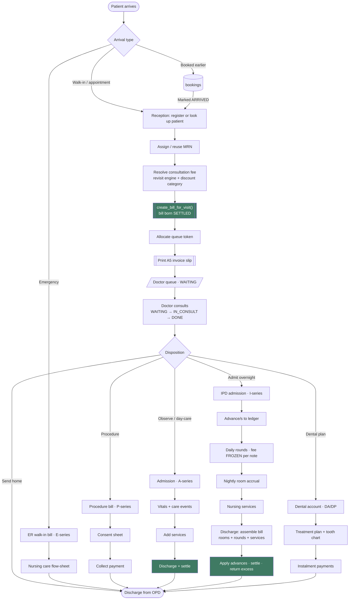
```mermaid
flowchart TD
    START([Patient arrives]) --> TYPE{Arrival type}

    TYPE -->|Walk-in / appointment| REG[Reception: register or look up patient]
    TYPE -->|Emergency| ER[ER walk-in bill · E-series]
    TYPE -->|Booked earlier| BOOK[(bookings)]

    BOOK -->|Marked ARRIVED| REG

    REG --> MRN[Assign / reuse MRN]
    MRN --> FEE[Resolve consultation fee<br/>revisit engine + discount category]
    FEE --> BILL[["create_bill_for_visit()<br/>bill born SETTLED"]]
    BILL --> TOKEN[Allocate queue token]
    TOKEN --> SLIP[[Print A5 invoice slip]]
    SLIP --> QUEUE[/Doctor queue · WAITING/]

    QUEUE --> CONSULT[Doctor consults<br/>WAITING → IN_CONSULT → DONE]

    CONSULT --> OUTCOME{Disposition}
    OUTCOME -->|Send home| HOME([Discharge from OPD])
    OUTCOME -->|Procedure| PROC[Procedure bill · P-series]
    OUTCOME -->|Observe / day-care| ADM[Admission · A-series]
    OUTCOME -->|Admit overnight| IPD[IPD admission · I-series]
    OUTCOME -->|Dental plan| DENT[Dental account · DA/DP]

    ER --> ERCARE[Nursing care flow-sheet] --> HOME

    PROC --> PCONSENT[Consent sheet] --> PPAY[Collect payment] --> HOME

    ADM --> AVITALS[Vitals + care events]
    AVITALS --> ASERV[Add services]
    ASERV --> ADISCH[Discharge + settle]
    ADISCH --> HOME

    IPD --> IADV[Advance/s to ledger]
    IADV --> IROUND[Daily rounds · fee FROZEN per note]
    IROUND --> IROOM[Nightly room accrual]
    IROOM --> ISERV[Nursing services]
    ISERV --> IDISCH[Discharge: assemble bill<br/>rooms + rounds + services]
    IDISCH --> ISETTLE[Apply advances · settle · return excess]
    ISETTLE --> HOME

    DENT --> DPLAN[Treatment plan + tooth chart]
    DPLAN --> DPAY[Instalment payments]
    DPAY --> HOME

    style BILL fill:#3F7A63,color:#fff
    style ISETTLE fill:#3F7A63,color:#fff
    style ADISCH fill:#3F7A63,color:#fff
```

### 3.2 Money lifecycle — collection to P&L

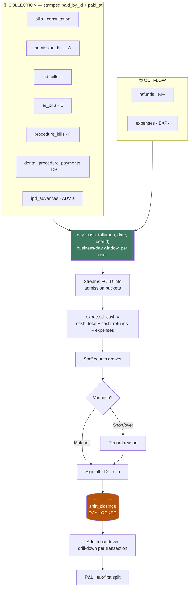
```mermaid
flowchart TD
    subgraph COLLECT["① COLLECTION — stamped paid_by_id + paid_at"]
        C1[bills · consultation]
        C2[admission_bills · A]
        C3[ipd_bills · I]
        C4[er_bills · E]
        C5[procedure_bills · P]
        C6[dental_procedure_payments · DP]
        C7[ipd_advances · ADV ±]
    end

    subgraph OUT["② OUTFLOW"]
        R1[refunds · RF-]
        E1[expenses · EXP-]
    end

    COLLECT --> TALLY[["day_cash_tally(pdo, date, userId)<br/>business-day window, per user"]]
    OUT --> TALLY

    TALLY --> FOLD[Streams FOLD into<br/>admission buckets]
    FOLD --> EXPECT["expected_cash =<br/>cash_total − cash_refunds − expenses"]

    EXPECT --> COUNT[Staff counts drawer]
    COUNT --> VAR{Variance?}
    VAR -->|Matches| CLOSE[Sign off · DC- slip]
    VAR -->|Short/over| REASON[Record reason] --> CLOSE

    CLOSE --> LOCK[(shift_closings<br/>DAY LOCKED)]
    LOCK --> HAND[Admin handover<br/>drill-down per transaction]
    HAND --> PL[P&L · tax-first split]

    style TALLY fill:#3F7A63,color:#fff
    style LOCK fill:#B45309,color:#fff
```

### 3.3 The fold / un-fold rule — why money is never double-counted

This is the single most subtle invariant in the system.

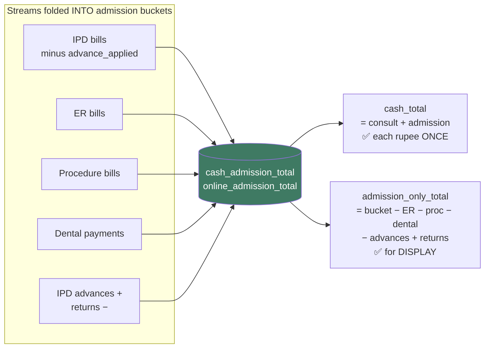
```mermaid
flowchart LR
    subgraph SOURCES["Streams folded INTO admission buckets"]
        S1[IPD bills<br/>minus advance_applied]
        S2[ER bills]
        S3[Procedure bills]
        S4[Dental payments]
        S5[IPD advances +<br/>returns −]
    end

    S1 & S2 & S3 & S4 & S5 --> BUCKET[(cash_admission_total<br/>online_admission_total)]

    BUCKET --> CASHTOT["cash_total<br/>= consult + admission<br/>✅ each rupee ONCE"]
    BUCKET --> ONLY["admission_only_total<br/>= bucket − ER − proc − dental<br/>− advances + returns<br/>✅ for DISPLAY"]

    style BUCKET fill:#3F7A63,color:#fff
```

**The rule, stated plainly:** every stream folds into the admission bucket so the
*stored* closing columns and the *printed* A5 slip capture it with **no schema change**.
But any stream that also gets its **own row** on the closing sheet must be **un-folded**
for that display line — otherwise the cashier sees the same money twice.

```php
// config/billing.php — the un-fold
foreach (['cash', 'online'] as $mode) {
    $t[$mode . '_admission_only_total'] = round(max(0, $t[$mode . '_admission_total']
        - $t[$mode . '_er_total'] - $t[$mode . '_procedure_total'] - $t[$mode . '_dental_total']
        - $t[$mode . '_advance_total'] + $t[$mode . '_advance_return_total']), 2);
}
```

Note the **`+ advance_return_total`**: a return was folded in *negative*, so removing it
means adding it back. And `max(0, …)` clamps a rounding-induced negative, because a
negative "Admissions" line reads as a bug to a cashier.

---

## 4. Module Map

| # | Module | Primary files | Core tables | Series |
|---|---|---|---|---|
| 1 | Auth & session | `index.php`, `config/auth.php` | `users` | — |
| 2 | RBAC | `permissions.php`, `config/permissions.php` | `permissions`, `role_permissions`, `user_permission_overrides` | — |
| 3 | Impersonation | `impersonate.php`, `config/impersonation.php` | `audit_logs` | — |
| 4 | Patients & OPD | `patients.php`, `receptionist.php` | `patients`, `visits`, `bills`, `bill_items` | `{seq}{YY}{MM}` |
| 5 | Doctor console | `doctor.php`, `my_queue.php` | `visits`, `consultation_notes` | — |
| 6 | Admissions | `admission.php`, `admission_discharge.php` | `admissions`, `admission_bills` | `A{seq}{YY}{MM}` |
| 7 | IPD | `ipd_admission.php`, `ipd_discharge.php` | `ipd_admissions`, `ipd_bills`, `ipd_doctor_visits` | `I…` |
| 8 | IPD advances | `config/ipd_advances.php` | `ipd_advances` | `ADV` |
| 9 | ER | `er_bill.php`, `er_services.php` | `er_bills` | `E{seq}{YY}{MM}` |
| 10 | Procedures | `procedure_bill.php`, `procedure_master.php` | `procedure_bills`, `procedure_bill_items` | `P{seq}{YY}{MM}` |
| 11 | Consent | `procedure_consents.php`, `config/consent.php` | `procedure_consents` | — |
| 12 | Dental | `dental_account.php`, `config/dental.php` | `dental_*` | `DA` / `DP` |
| 13 | Closings | `shift_closing.php` | `shift_closings` | `DC-` |
| 14 | Handover | `admin_handovers.php` | `admin_handovers` | — |
| 15 | Refunds | `refund.php` | `refunds`, `refund_sequences` | `RF-YYYY-NNNN` |
| 16 | Expenses | `expenses.php`, `approve_expense.php` | `expenses`, `expense_categories` | `EXP-` |
| 17 | Bookings | `bookings.php` | `bookings` | — |
| 18 | Scheduling | `doctor_timings.php`, `my_schedule.php` | `doctor_day_timings` | — |
| 19 | Reports | `pnl_report.php`, `income_report.php`, … | (reads) | — |
| 20 | Notifications | `config/notify.php` | `notifications` | — |
| 21 | Sheets | `config/sheets.php`, `sheet_log.php` | `sheet_sync_queue` | — |
| 22 | Staff | `staff.php`, `profile.php` | `users`, `staff_documents` | — |

---

## 5. Authentication & Session

### Login sequence — `index.php`

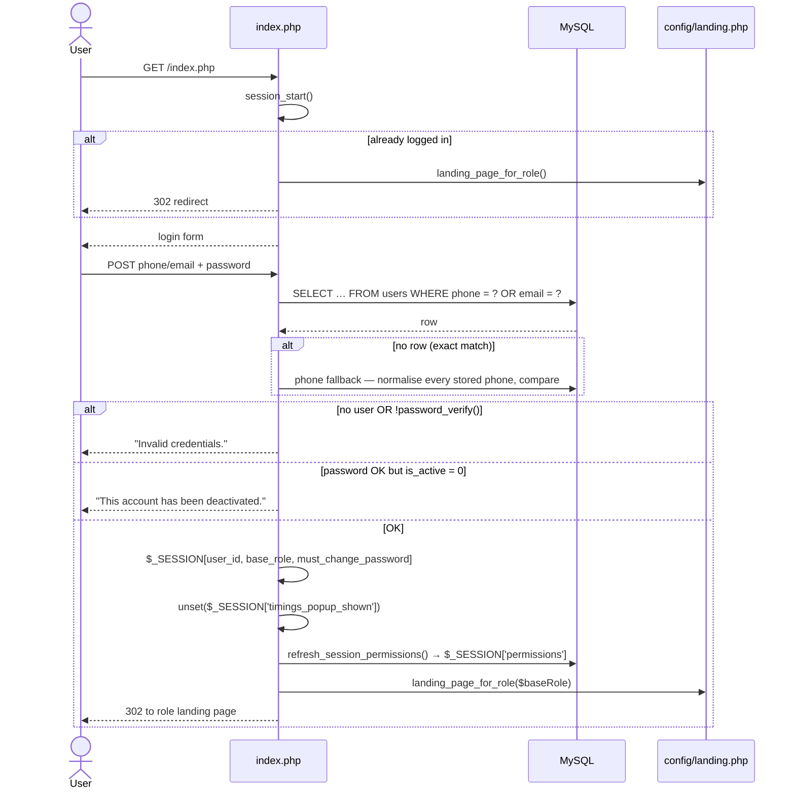
```mermaid
sequenceDiagram
    actor U as User
    participant I as index.php
    participant DB as MySQL
    participant L as config/landing.php

    U->>I: GET /index.php
    I->>I: session_start()
    alt already logged in
        I->>L: landing_page_for_role()
        I-->>U: 302 redirect
    end
    I-->>U: login form

    U->>I: POST phone/email + password
    I->>DB: SELECT … FROM users WHERE phone = ? OR email = ?
    DB-->>I: row

    alt no row (exact match)
        I->>DB: phone fallback — normalise every stored phone, compare
    end

    alt no user OR !password_verify()
        I-->>U: "Invalid credentials."
    else password OK but is_active = 0
        I-->>U: "This account has been deactivated."
    else OK
        I->>I: $_SESSION[user_id, base_role, must_change_password]
        I->>I: unset($_SESSION['timings_popup_shown'])
        I->>DB: refresh_session_permissions() → $_SESSION['permissions']
        I->>L: landing_page_for_role($baseRole)
        I-->>U: 302 to role landing page
    end
```

**Session variables set on success** (`index.php:52-64`) — exactly three, plus permissions:

```php
$_SESSION['user_id']              = $user['id'];
$_SESSION['base_role']            = $user['base_role'];
$_SESSION['must_change_password'] = (bool) $user['must_change_password'];
unset($_SESSION['timings_popup_shown']);   // fresh shift → doctor-timings popup re-fires
refresh_session_permissions($pdo);         // populates $_SESSION['permissions']
```

**The phone fallback.** If the exact `email = ? OR phone = ?` lookup misses, and the
identifier has ≥ 7 chars and no `@`, the login loops every stored phone comparing
`normalize_staff_phone()` output — so a legacy `+92 300…` row still authenticates a
`0300…` login.

**Security properties — and their limits:**

| Property | Status |
|---|---|
| Password hashing | ✅ `password_hash(PASSWORD_BCRYPT)` / `password_verify()` |
| `is_active = 0` blocks login | ✅ `add_user_active_status.sql` |
| Session fixation defence | ❌ **no `session_regenerate_id()` anywhere in the app** |
| Login throttle / lockout | ❌ none |
| Failed-login audit trail | ❌ none — failures write no `audit_logs` row |
| CSRF on the login form | ❌ none |
| `password_needs_rehash()` | ❌ never called — bcrypt cost never upgrades |

> **⚠️ The deactivation message confirms a correct password.** The `is_active` check runs
> *after* `password_verify()` succeeds, so "This account has been deactivated" is only
> ever shown to someone who typed the right password — telling a correct guesser that
> their guess was right.

> **⚠️ `must_change_password` is set but never enforced.** `index.php` populates the
> session flag and `change-password.php` clears it, but **no page redirects on it**. It
> is a flag with no gate.

### ⚠️ `login_fix.php` — a live rescue back door

**This file is present in the repository and reachable in production.** It requires **no
login**, gated solely by a hardcoded key in a tracked file:

```php
const FIX_KEY = 'FIX-HIMS-2026';
if (($_GET['key'] ?? '') !== FIX_KEY) { /* 404 */ }
```

With that key it will reset **any ADMIN account's password** and, before submission,
renders a diagnostic listing **every admin's id, name, email and phone** plus whether
their stored hash is well-formed. It calls `@unlink(__FILE__)` after a successful reset —
but only *after* one succeeds, so until then it stays live.

The password reset it performs is audit-logged as `password_rescue` attributed to the
**target user**, not to any actor — because there is no authenticated actor to attribute
it to.

> **This is the single highest-severity item in the codebase.** It is an unauthenticated
> admin-account enumeration plus password-reset endpoint behind one static string. See
> [§36](#36-known-debt--pending-migrations).

### Logout

```php
require_once __DIR__ . '/config/auth.php';
session_destroy();
header('Location: /index.php');
```

`session_destroy()` only — no `$_SESSION = []`, no cookie expiry.

### Login identifier: phone normalisation

Staff log in by phone. Humans type it a dozen ways, so `normalize_staff_phone()`
(`config/auth.php`) folds everything to one canonical local form — digits only, leading
zero:

| Typed | Stored |
|---|---|
| `+92 300 1234567` | `03001234567` |
| `0092-300-1234567` | `03001234567` |
| `92 300 1234567` | `03001234567` |
| `0300 1234567` | `03001234567` |

`staff_phone_in_use()` compares **normalised-to-normalised** across all users, so a
legacy `+92300…` row still blocks a new `0300…` claim — they are the same login.

> **Note the asymmetry:** *staff* phones are stored local (`03001234567`); *patient*
> phones are stored **E.164** (`+923001234567`). Different columns, different rules.

### Landing pages — `config/landing.php`

```php
function landing_page_for_role(string $baseRole): string
{
    if ($baseRole === 'DOCTOR') { return '/doctor.php'; }
    if ($baseRole === 'ADMIN')  { return '/dashboard.php'; }
    // STAFF — permission-driven, because STAFF is ONE role covering every desk
    if (has_permission('RECEPTION_REGISTER_PATIENTS')) { return '/receptionist.php'; }
    if (has_permission('NURSING_RECORD_ADMISSIONS'))   { return '/admissions.php'; }
    return '/dashboard.php';
}
```

A receptionist and a nurse share the `STAFF` base role; where they land is decided by
**what they can do**, not by a sub-role that no longer exists.

---

## 6. RBAC — Roles & Permissions

### Three base roles

| Base role | Who | Landing |
|---|---|---|
| `ADMIN` | Owner / administrator (the terms are used interchangeably) | `dashboard.php` |
| `DOCTOR` | Consultants, surgeons, dentists | `doctor.php` |
| `STAFF` | Reception, nursing, in-door, accounts — **every** desk worker | permission-driven |

**The ENUM has four values, but there are three base roles.** History:

| Migration | `users.base_role` ENUM |
|---|---|
| original | `('ADMIN','DOCTOR','MANAGER','ACCOUNTANT','NURSE','RECEPTIONIST')` |
| `collapse_roles_to_staff.sql` phase 1 | widened to add `'STAFF'` |
| `collapse_roles_to_staff.sql` phase 4 | **`('ADMIN','DOCTOR','STAFF')`** |
| `add_manager_role.sql` | `('ADMIN','DOCTOR','MANAGER','STAFF')` ← live |

`MANAGER` occupies the 4ᵗʰ slot but is a **permission preset, not a role**: **nothing in
the code ever checks the string `'MANAGER'`.** The asymmetry is deliberate —
`permissions.php` lists only `['ADMIN','DOCTOR','STAFF']` (MANAGER's defaults are not
editable on the Permissions screen), while `staff.php` lists
`['STAFF','MANAGER','DOCTOR','ADMIN']` (MANAGER *is* assignable to a person).
`landing_page_for_role()` has no MANAGER branch, so a manager falls through to the STAFF
path.

**The shipped MANAGER bundle is 5 keys**: `FINANCIAL_APPROVE_EXPENSES`,
`FINANCIAL_VOID_BILL`, `ADMISSION_APPROVE_WRITEOFF`, `ADMIN_RECEIVE_HANDOVER`,
`RECEPTION_CLOSE_DAY`. The three `FINANCIAL_VIEW_*` report keys were **removed from the
bundle on 2026-07-27** when finance reports became admin-only; a manager who needs one
gets an explicit per-user grant.

### Resolution model

```mermaid
flowchart LR
    A[role_permissions<br/>defaults for base_role] --> M{{merge}}
    B[user_permission_overrides<br/>granted = 1 / 0] --> M
    M --> S[$_SESSION['permissions']<br/>array of keys]
    S --> H["has_permission('KEY')"]
    H --> G["require_permission('KEY')"]
    H --> N[sidebar 'perm' gate]
```

```php
function load_permissions(PDO $pdo, int $userId, string $baseRole): array {
    // 1. role defaults
    $stmt = $pdo->prepare('SELECT p.`key` FROM role_permissions rp
        JOIN permissions p ON p.id = rp.permission_id WHERE rp.base_role = ?');
    $stmt->execute([$baseRole]);
    $effective = array_fill_keys(array_column($stmt->fetchAll(), 'key'), true);

    // 2. per-user overrides layered ON TOP — grant adds, revoke removes
    $stmt = $pdo->prepare('SELECT p.`key`, o.granted FROM user_permission_overrides o
        JOIN permissions p ON p.id = o.permission_id WHERE o.user_id = ?');
    $stmt->execute([$userId]);
    foreach ($stmt->fetchAll() as $row) {
        if ((int) $row['granted'] === 1) { $effective[$row['key']] = true; }
        else                             { unset($effective[$row['key']]); }
    }
    return array_keys($effective);
}
```

> **⚠️ Migration run-order:** overrides are applied **grant before revoke** within the
> loop's natural order. When seeding permissions via SQL, run **grants first, then
> revokes** — reversing it re-grants what you meant to remove.

### The killed bypass

Earlier code gated pages as `has_permission($k) || in_array($role, ['ADMIN', …])`. That
role fallback made per-user revokes **unenforceable** — an admin could never be denied
anything, and a demoted user kept access. It was removed in the RBAC overhaul.

**Today there is exactly one gate:**

```php
function has_permission(string $key): bool {
    return in_array($key, $_SESSION['permissions'] ?? [], true);
}
```

The only surviving role check is `config/guard_admin.php`, a deliberate hard wall for
admin-only screens:

```php
if (($_SESSION['base_role'] ?? '') !== 'ADMIN') {
    http_response_code(403);
    exit('Forbidden — admin access only.');
}
```

### The 403 page

`require_permission()` does not dump a raw error. It renders a **self-contained** 403
page (inline CSS — shared partials load *after* this check) that **names the missing
capability** and says how to get it. It content-negotiates: JSON callers get JSON.

```php
function require_permission(string $key): void {
    if (has_permission($key)) { return; }
    http_response_code(403);
    $label = permission_label($key);
    if (stripos($accept, 'application/json') !== false && stripos($accept, 'text/html') === false) {
        header('Content-Type: application/json');
        exit(json_encode(['error' => 'forbidden', 'permission' => $key, 'label' => $label]));
    }
    // … standalone HTML naming $label and $key, then exit
}
```

### The two-part gating rule

> **A gated page needs BOTH `require_permission('KEY')` at the top AND a matching
> `'perm' => 'KEY'` on its sidebar entry.** The page gate enforces access; the sidebar
> `perm` decides visibility. Omit the page gate and the link is merely hidden while the
> URL stays open. Omit the sidebar `perm` and a permitted user cannot find the page.

`partials/sidebar.php` filters purely on permission — never on role:

```php
// 'perm' gates on an ACTUAL permission, not a role — so a per-user grant works.
if (!empty($it['perm']) && !has_permission($it['perm'])) { return false; }
```

A collapsible parent has no `perm` of its own; it qualifies on having ≥1 visible child —
and is **dropped entirely if no non-disabled child survives**, so a disclosure never opens
onto a dead end.

Three subtleties in the group-level rules:

1. **An admin group is narrowed, not dropped, for a non-admin.** A MANAGER holding
   `FINANCIAL_VIEW_CLINIC_REPORTS` sees just that link inside Analytics — *"without this
   they could reach the Expense Report by URL yet never see a link to it."*
2. **A group's role gate is a default, not a lock** — when it fails, items carrying their
   own `perm` still show.
3. `notAdmin` exists so Expenses and Day Closing don't render **twice** for an admin (once
   in Workspace, once in Finances).

**Doctors bypass the shared nav entirely** — `sidebar.php` delegates to
`doctor_sidebar.php` and returns early, passing the doctor's `specialty` through so dental
links stay hidden from non-dentists (the `DENTAL_*` keys are DOCTOR-role defaults, so a
paediatrician holds them too and would otherwise see a tooth chart).

> **⚠️ Known asymmetries.** `bookings.php` and `doctor_timings.php` hand-roll
> `http_response_code(403); exit('Forbidden — …')` instead of calling
> `require_permission()`, so they render bare text rather than the friendly 403 page.
> `discount_report.php` and `sheet_log.php` have sidebar items with **no `perm`** and rely
> on `guard_admin.php` instead.

### Permission catalogue (by category)

**Reception** — `RECEPTION_REGISTER_PATIENTS`, `RECEPTION_GENERATE_INVOICES`,
`RECEPTION_GENERATE_OPD_SLIPS`, `RECEPTION_PROCESS_PAYMENTS`,
`RECEPTION_CAPTURE_PAYMENT_MODE`, `RECEPTION_MANAGE_BOOKINGS`,
`RECEPTION_EDIT_DOCTOR_TIMINGS`, `RECEPTION_CLOSE_DAY`, `RECEPTION_MANAGE_CONSENT`,
`RECEPTION_PRINT_CONSENT`, `RECEPTION_UPLOAD_CONSENT`

**Nursing** — `NURSING_RECORD_ADMISSIONS`, `NURSING_RECORD_VITALS`,
`NURSING_LOG_CHARGEABLE_EVENTS`, `NURSING_PERFORM_PROCEDURES`,
`NURSING_DISCHARGE_PATIENT`, `NURSING_ATTEND_SHORT_STAY`, `NURSING_SELF_ATTEND`,
`NURSING_SKIP_ROTATION`

**Clinical** — `CLINICAL_ADD_NOTES`, `CLINICAL_VIEW_MEDICAL_RECORD`,
`CLINICAL_VIEW_VITALS_HISTORY`, `CLINICAL_VIEW_PAST_PROCEDURES`,
`CLINICAL_VIEW_CONSULTATION_NOTES`

**Financial** — `FINANCIAL_VIEW_INVOICES`, `FINANCIAL_VIEW_OWN_EARNINGS`,
`FINANCIAL_VIEW_ALL_COMMISSIONS`, `FINANCIAL_VIEW_DAILY_PL`,
`FINANCIAL_VIEW_CLINIC_REPORTS`, `FINANCIAL_RUN_PAYOUT`, `FINANCIAL_POST_EXPENSES`

**Admin** — `ADMIN_MANAGE_USERS`, `ADMIN_EDIT_STAFF_DETAILS`,
`ADMIN_ASSIGN_PERMISSIONS`, `ADMIN_VIEW_AUDIT_LOGS`,
`ADMIN_CONFIGURE_FINANCIAL_SETTINGS`, `ADMIN_CONFIGURE_COMMISSION_SETTINGS`,
`ADMIN_MANAGE_PROCEDURE_MASTER`, `ADMIN_MANAGE_EXPENSE_CATEGORIES`,
`ADMIN_MANAGE_CONSENT_TEMPLATES`

**IPD / Dental / Doctor** — `IPD_VIEW_WARD` (legacy token), `DENTAL_RECORD_TREATMENT`,
`DENTAL_VIEW_ACCOUNTS`, `DENTAL_MANAGE_LAB_WORK`, `DOCTOR_APPROVE_PROCEDURE_DISCOUNT`

> **Finance reports are ADMIN-ONLY:** P&L, Doctor Share Statement and Tax Register are
> locked to admin (`sql/lock_finance_reports_to_admin.sql`).

### Audit logging

All audit writes funnel through **one** function, so impersonation survives in the trail:

```php
function audit_log(PDO $pdo, string $action, string $details, $userId = false): void {
    if ($userId === false) { $userId = $_SESSION['user_id'] ?? null; }
    if (function_exists('imp_audit_suffix')) { $details .= imp_audit_suffix(); }
    $pdo->prepare('INSERT INTO audit_logs (user_id, action, details) VALUES (?, ?, ?)')
        ->execute([$userId !== null ? (int) $userId : null, $action, $details]);
}
```

A DB trigger would have caught every call site automatically — but **this DB user is
denied `CREATE ROUTINE`**, so tagging happens in PHP instead.

---

## 7. Impersonation ("View as staff")

**Path:** Settings → Staff & Doctors → row → **View as**

An admin can operate the app exactly as a staff member sees it — to reproduce a bug, or
to verify what a shift tally shows on *that person's* screen.

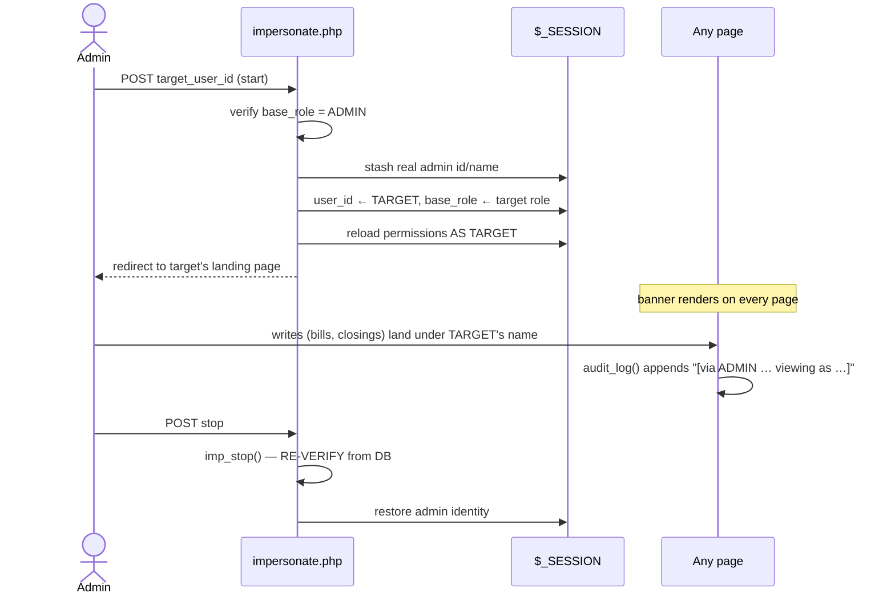
```mermaid
sequenceDiagram
    actor A as Admin
    participant IMP as impersonate.php
    participant S as $_SESSION
    participant P as Any page

    A->>IMP: POST target_user_id (start)
    IMP->>IMP: verify base_role = ADMIN
    IMP->>S: stash real admin id/name
    IMP->>S: user_id ← TARGET, base_role ← target role
    IMP->>S: reload permissions AS TARGET
    IMP-->>A: redirect to target's landing page

    Note over P: banner renders on every page
    A->>P: writes (bills, closings) land under TARGET's name
    P->>P: audit_log() appends "[via ADMIN … viewing as …]"

    A->>IMP: POST stop
    IMP->>IMP: imp_stop() — RE-VERIFY from DB
    IMP->>S: restore admin identity
```

### Why writes are attributed to the target

`$_SESSION['user_id']` **becomes** the staff member — deliberately. Day-cash and closing
totals key off `paid_by_id`, so if an admin took a payment while viewing as a
receptionist, that cash must land on the **receptionist's** drawer or their physical
count would never reconcile.

That leaves the **audit log** as the only place the admin's involvement is recorded —
hence the automatic `[via ADMIN … viewing as …]` suffix. `imp_audit_suffix()` returns
`''` outside impersonation, so it is a no-op wrapper in normal sessions.

### Guard rails on entry — `imp_start()`

| Rail | Reason |
|---|---|
| **POST only** | "a GET would let a stray link or a prefetch flip who you are" |
| **No nesting** | prevents the parked admin identity being overwritten and stranded |
| **Re-read the admin from the DB** | a stale session must not open the door for a since-demoted admin |
| **No self-impersonation** | — |
| **Target may not be ADMIN** | "that would launder an admin action into someone else's name" |
| Inactive targets **are** allowed | that is often *why* you are looking |

Note `impersonate.php` deliberately does **not** use `guard_admin.php`: while
impersonating, the session role is the *target's*, so the admin would be locked out of
the very endpoint that gives their account back. It runs its own ADMIN check on `start`
only — authorisation for `stop` is the presence of a parked admin identity, which only
`imp_start()` can create.

### The money brake

Because writes land under the target's name, four irreversible cash actions (refund,
void, close-day, take-payment) call `imp_block_money_action()`, which refuses unless the
form also posts an `imp_confirm` checkbox rendered by `imp_confirm_field()`. It is
server-side deliberately: the browser `confirm()` shown at the start of a session that
may run an hour is not a check on the request that actually moves the money.

`profile.php` additionally hard-blocks `save_details` while impersonating — name, email
and phone *are* the login credentials, so editing them would change how that person signs
in, from inside their account.

### ⚠️ The exit-path bug — and why it worked

> **Hold the exit path to the same standard as the entry path.**

`imp_stop()` originally restored `$_SESSION['imp_admin_role']` — a *snapshot* of what was
true when impersonation began — falling back to the literal `'ADMIN'`. Three facts
combined to make that exploitable:

1. `imp_admin_role` is a **memory**, not a fact.
2. `load_permissions($pdo, $userId, $baseRole)` takes the role **as a parameter and
   trusts it** — it never re-reads `users.base_role`.
3. `is_active` is verified **only at login**, never on any later request.

So an admin demoted or deactivated *during* an impersonation got a **full ADMIN
permission set re-minted** on exit. The fix re-authorises against the database exactly as
entry does; if the user is no longer an active admin, nothing is restored — the session
is destroyed and the event logged as `impersonation_stop_denied`.

The restore also writes `must_change_password` from the **DB row**, not a hardcoded
`false` — otherwise an admin could skip a reset another admin had just required of them.
Session state is rewritten **before** the audit insert, so a failed log cannot strand the
session in the target's identity.

> **Residue worth knowing:** `imp_admin_role` is still written and still unset, but is
> **no longer read on the restore path**.

### ⚠️ CSRF — one endpoint only

`imp_csrf_token()` / `imp_csrf_valid()` mint a per-session 64-hex token compared with
`hash_equals()`. It guards **both** `start` and `stop`.

> **This is the only CSRF protection in the entire application.** It was fixed here first
> because this is the one endpoint where a forged request changes *who you are* rather
> than *what you did*. Every other POST in HIMS remains unprotected — see
> [§36](#36-known-debt--pending-migrations).

---

## 8. The Money Engine

`config/billing.php` — ~2,500 lines, 47 functions. This is the heart of the system.

### 8.1 The doctor split — tax-first

The single most important calculation. Used for consultations and IPD rounds.

```php
function doctor_split(float $amount, float $sharePct, bool $hasTax,
                      float $taxPct, float $disposables = 0.0): array {
    // Clamp instead of throw — one bad row must not kill a monthly report
    $amount      = max(0.0, $amount);
    $sharePct    = min(100.0, max(0.0, $sharePct));
    $taxPct      = $hasTax ? min(100.0, max(0.0, $taxPct)) : 0.0;
    $disposables = min($amount, max(0.0, $disposables));

    $divisible = $amount - $disposables;          // step 1 — recover supply cost
    $tax       = $divisible * $taxPct / 100;      // step 2 — tax off the FULL fee
    $remainder = $divisible - $tax;
    $doctor    = $remainder * $sharePct / 100;    // step 3 — split the remainder
    $clinic    = $remainder - $doctor;            // subtraction, NOT a second %

    return ['gross' => $amount, 'disposables' => $disposables, 'tax' => $tax,
            'doctor' => $doctor,
            'clinic' => $clinic + $disposables,   // cost recovery belongs to clinic
            'clinic_net' => $clinic];
}
```

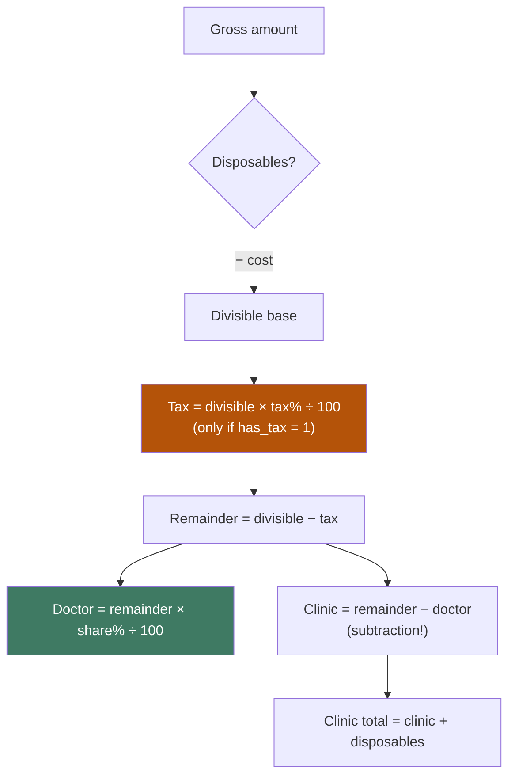
```mermaid
flowchart TD
    G["Gross amount"] --> D1{Disposables?}
    D1 -->|"− cost"| DIV["Divisible base"]
    DIV --> T["Tax = divisible × tax% ÷ 100<br/>(only if has_tax = 1)"]
    T --> REM["Remainder = divisible − tax"]
    REM --> DOC["Doctor = remainder × share% ÷ 100"]
    REM --> CLI["Clinic = remainder − doctor<br/>(subtraction!)"]
    CLI --> CLIT["Clinic total = clinic + disposables"]

    style T fill:#B45309,color:#fff
    style DOC fill:#3F7A63,color:#fff
```

**Why clinic is a subtraction, not `remainder × (100 − share)%`:** floating-point means
two independent percentages need not re-sum to the whole. Subtracting guarantees
`disposables + tax + doctor + clinic_net == amount` exactly.

**`clinic` vs `clinic_net`:** `clinic` *includes* recovered supply cost (so callers
totalling clinic income need not know about disposables); `clinic_net` excludes it, for
reports showing cost and margin as separate lines.

**Tax = 0 is not missing data.** A doctor who self-deposits their own tax has
`consult_has_tax = 0`, and a correctly-zero tax figure.

### 8.2 The SQL twin

Monthly reports span thousands of bills, so the same rule exists as SQL for set-based
aggregation:

```php
function doctor_split_sql(string $amt, string $share, string $hasTax, string $tax,
                          string $part = 'doctor', string $disposables = '0'): string {
    $disp      = "LEAST($amt, GREATEST(0, $disposables))";
    $divisible = "($amt - $disp)";
    $taxExpr   = "(CASE WHEN $hasTax = 1 THEN $divisible * $tax / 100 ELSE 0 END)";
    $remainder = "($divisible - $taxExpr)";
    switch ($part) {
        case 'tax':         return $taxExpr;
        case 'disposables': return $disp;
        case 'clinic':      return "($remainder - $remainder * $share / 100 + $disp)";
        case 'clinic_net':  return "($remainder - $remainder * $share / 100)";
        default:            return "($remainder * $share / 100)";
    }
}
```

> **⚠️ Two critical constraints.**
> 1. **Keep the two in lockstep.** If the rule changes, both must change together —
>    that is the price of having a SQL form at all.
> 2. **The arguments are COLUMN EXPRESSIONS, not values.** They are interpolated
>    directly into SQL. Every call site passes hardcoded column names and **must stay
>    that way** — passing user input here is SQL injection.

### 8.3 Consultation vs procedure — the orders differ

> **This is the most common source of confusion in the codebase.**

| | Consultation | Procedure |
|---|---|---|
| Share rate lives on | the **doctor** (`users.consult_share_pct`) | the **procedure line** (per-item snapshot) |
| Order | tax off **full fee first**, then split | per-**line** snapshot, split line-by-line |
| Aggregate-able? | yes — one rate per doctor | **no** — must sum line by line |

Because each procedure line carries its own `doctor_share_pct` / `has_tax` /
`tax_percent`, `doctor_procedure_earnings()` sums `doctor_split_sql()` over the **item**
columns rather than calling `doctor_split()` on a bill total.

### 8.4 The business day

A late shift running past midnight must close as **one** shift, not split across two
calendar dates.

```php
function day_cutoff_hour(PDO $pdo): int {   // default 4 (04:00 PKT), admin-configurable
    // cached per request; clinic_settings['day_cutoff_hour']
    return $hour = max(0, min(23, $h));
}

function business_day(PDO $pdo, ?string $atDateTime = null): string {
    $cutoff = day_cutoff_hour($pdo);
    $ts = $atDateTime ? strtotime($atDateTime) : time();
    if ($cutoff > 0 && (int) date('G', $ts) < $cutoff) {
        $ts -= 86400;   // still yesterday's business day
    }
    return date('Y-m-d', $ts);
}

function business_day_window(PDO $pdo, string $businessDate): array {
    $cutoff = day_cutoff_hour($pdo);
    $start = sprintf('%s %02d:00:00', $businessDate, $cutoff);
    $end   = date('Y-m-d H:i:s', strtotime($start) + 86400);
    return [$start, $end];   // [start, end)
}
```

With cutoff 4, business day **D** runs `D 04:00:00` → `D+1 04:00:00`. Tally queries
range over `paid_at` with `>= start AND < end` — **never** `DATE(paid_at) = …`.

> **Exception:** expenses key off the `expense_date` **DATE** column (they are *posted
> for* a business day), not off a timestamp window.

### 8.5 `day_cash_tally()` — the full bucket list

`day_cash_tally(PDO $pdo, string $date, int $userId)` returns one receptionist's
system-side tally for one business day. Every query filters
`voided_at IS NULL` **and** `paid_by_id = $userId`.

| Stream | Table | Status filter | Amount summed | Own row? | Folded? |
|---|---|---|---|---|---|
| Consultation | `bills` | `= 'paid'` | `paid_amount` | ✅ | — |
| Admission | `admission_bills` | `IN ('paid','finalized')` | `paid_amount` | ✅ | — |
| IPD | `ipd_bills` | `= 'paid'` | `paid_amount − advance_applied` | ❌ | → admission |
| ER | `er_bills` | `= 'paid'` | `paid_amount` | ✅ | → admission |
| Procedure | `procedure_bills` | `= 'paid'` | `paid_amount` | ✅ | → admission |
| Dental | `dental_procedure_payments` | `= 'paid'` | **`amount`** | ✅ | → admission |
| Advance (in) | `ipd_advances` | `direction <> 'REFUND'` | `amount` | ✅ | → admission **+** |
| Advance (return) | `ipd_advances` | `direction = 'REFUND'` | `amount` | ✅ | → admission **−** |
| Cash refund | `refunds` | `refund_mode = 'cash'` | `amount` | ✅ | deducted |
| Expense | `expenses` | `source = 'CASH_COUNTER'` | `amount` | ✅ | deducted |

**Four subtleties worth stating explicitly:**

**① Admission bills include `'finalized'`, not just `'paid'`.** A partial discharge
payment sits at `finalized` until an admin approves the write-off — but the cash reached
the drawer the moment it was taken, so it belongs on the collector's shift **now**.
`SUM(paid_amount)` makes this safe: a finalized row contributes only what was handed
over, never `grand_total`. Rows with `paid_amount = 0` add nothing.

**② IPD subtracts `advance_applied`.**

```php
$ipdAdvCol = column_exists($pdo, 'ipd_bills', 'advance_applied')
    ? 'COALESCE(paid_amount, 0) - COALESCE(advance_applied, 0)'
    : 'COALESCE(paid_amount, 0)';
```

`ipd_bills.paid_amount` is the **full settlement** — cash at discharge *plus* whatever
the advance covered — because the invoice must show what the patient paid in total. But
the advance already entered the drawer the day it was taken. Summing both double-counts:
*a Rs 23,000 bill settled with a Rs 15,000 advance and Rs 8,000 cash would read Rs 38,000
against a drawer that only ever saw Rs 23,000.*

**③ Dental has no `paid_amount` — it uses `amount`.** A dental payment row **is** the
money (an account is paid down over many receipts, so there is no single bill total to
settle). Its status vocabulary is `'paid'|'voided'` only — there is no waived *payment*;
waiving happens by voiding **items**, which lowers what is owed.

**④ Cash refunds hit the original payer's drawer.**

```php
$drawerExpr = column_exists($pdo, 'refunds', 'paid_out_by_id')
    ? 'COALESCE(paid_out_by_id, generated_by_id)'
    : 'generated_by_id';
```

Normally the receptionist who took the original payment — **not** whoever clicked
"Refund", who could be a doctor or admin with no drawer at all.

### 8.6 The final arithmetic

```php
$t['cash_total']    = round($t['cash_consult_total']   + $t['cash_admission_total'], 2);
$t['online_total']  = round($t['online_consult_total'] + $t['online_admission_total'], 2);
$t['net_collected'] = round($t['cash_total'] + $t['online_total'] - $t['cash_refund_total'], 2);

// Personal accountability only — NO drawer float here
$t['expected_cash'] = round($t['cash_total'] - $t['cash_refund_total'] - $t['expense_total'], 2);
```

Because ER, procedures, dental and advances are **already folded** into the admission
buckets, none is added again — that would double-count. An advance **return** folded in
negative, so it is already deducted from `expected_cash` without a separate subtraction:
returning an advance empties the drawer exactly like a refund does.

### 8.7 Payment methods — "write two, read four"

`config/payment_methods.php` is the **one** place "how did the money come in" is defined.

**The UI offers exactly two choices: Cash and Online / Card.**

That is not a simplification — it is what the books already said. Every money bucket
splits on `payment_method = 'cash'` vs `<> 'cash'` and nothing else. Not one query ever
asked for `bank_transfer` or `cheque` as its own bucket, so the four-option `<select>`
that sat on six money forms was collecting a distinction the accounts discarded a line
later.

```php
const PAY_METHODS_IN = ['cash', 'card'];   // what a form MAY post

function pay_method_label(?string $method): string {
    switch ((string) $method) {
        case 'cash':          return 'Cash';
        case 'card':
        case 'bank_transfer': // legacy — folded
        case 'cheque':        // legacy — folded
                              return 'Online / Card';
        default:              return '—';   // em dash, never a blank line
    }
}

function pay_method_in(?string $raw, string $fallback = 'cash'): string {
    return in_array($raw, PAY_METHODS_IN, true) ? $raw : $fallback;
}
```

- **Write two:** `PAY_METHODS_IN` whitelists every receive-money form.
- **Read four:** the DB is full of historical `bank_transfer`/`cheque` rows. They are
  **not migrated** and the ENUMs are **not narrowed** — a 2025 invoice must stay
  reprintable. They fold into "Online / Card" so a reprint reads like everything else.

> **Why `pay_method_in()` exists:** without it, a crafted POST reaches the `UPDATE`, and
> MySQL in non-strict mode coerces an out-of-ENUM value to `''` — which then reads as
> **not cash** in every `<> 'cash'` tally, quietly moving cash into the online column
> where it can never be reconciled against the drawer.

**Deliberately out of scope:** `refunds.refund_mode` (money going *out*, its own
three-value vocabulary) and `expenses.source` (`CASH_COUNTER`/`BANK`/`OWNER` — not a
payment method at all).

> **The bug this file fixed:** the label map was copy-pasted into four print partials
> plus three drifted variants ("Card", "Online-Card"), while **three surfaces had no map
> at all** and printed the raw enum — `ipd_invoice.php` handed a patient a slip reading
> **"Paid (bank_transfer)"**.

The shared control renders real radios, so it posts, validates and keyboard-navigates
like the `<select>` it replaced:

```php
<?= pay_method_toggle('payment_method', 'cash', 'chk') ?>
```

---

## 9. Document Number Series

Every document type has its **own** counter table, so series never collide.

| Series | Format | Example | Table | Counter | Reset |
|---|---|---|---|---|---|
| Consultation | `{seq}{YY}{MM}` | `1202607` | `bills` | `invoice_counters` | monthly |
| Admission | `A{seq}{YY}{MM}` | `A1202607` | `admission_bills` | `admission_invoice_counters` | monthly |
| ER | `E{seq}{YY}{MM}` | `E1202607` | `er_bills` | `er_invoice_counters` | monthly |
| Procedure | `P{seq}{YY}{MM}` | `P1202607` | `procedure_bills` | `procedure_invoice_counters` | monthly |
| IPD | `I…` | — | `ipd_bills` | — | monthly |
| Refund | `RF-YYYY-NNNN` | `RF-2026-0021` | `refunds` | `refund_sequences` | yearly |
| Expense | `EXP-…` | — | `expenses` | — | — |
| Day closing | `DC-…` | — | `shift_closings` | — | — |
| Dental account | `DA…` | — | `dental_*` | — | — |
| Dental payment | `DP…` | — | `dental_procedure_payments` | — | — |
| MRN | `{seq}{YY}{MM}` | — | `patients` | monthly counter | monthly |

**Reading `1202607`:** the 12ᵗʰ invoice of July 2026 — sequence `12`, year `26`,
month `07`, as one continuous run of digits. The sequence restarts at 1 each month; year
and month are carried *inside* the number, so the pair `(yr, mo)` is what makes it
unique, not the sequence alone. The MRN uses the same encoding.

### Two generation strategies

**① Atomic upsert** (consultation, MRN, tokens):

```php
$stmt = $pdo->prepare('
    INSERT INTO invoice_counters (yr, mo, next_seq) VALUES (?, ?, 2)
    ON DUPLICATE KEY UPDATE next_seq = LAST_INSERT_ID(next_seq) + 1
');
$stmt->execute([$year, $month]);
// rowCount() distinguishes: MySQL reports 1 for a fresh INSERT, 2 for the update path
$seq = $stmt->rowCount() === 1 ? 1 : (int) $pdo->lastInsertId();
```

**② GREATEST-of-(counter, real max)** — A / E / P / RF series:

```php
SELECT GREATEST(
    COALESCE((SELECT next_seq - 1 FROM admission_invoice_counters WHERE yr = :y AND mo = :m), 0),
    COALESCE((SELECT MAX(CAST(SUBSTRING(invoice_number, 2, CHAR_LENGTH(invoice_number) - 5) AS UNSIGNED))
              FROM admission_bills WHERE invoice_number LIKE :pfx), 0)
) + 1
```

> **Why the second strategy exists — a real production failure.** `LAST_INSERT_ID()` on
> an `ON DUPLICATE KEY` **update** is unreliable across MySQL setups. After a DB restore
> or a re-run migration left the counter *behind* the rows on record, it re-issued
> **duplicate `RF-2026-0001`** (observed live 2026-07-24). Deriving from the **real max
> already in the table** makes the series immune to counter drift.
>
> **Parsing note:** the stored number is `A{seq}{YY}{MM}`, so the sequence is the middle
> — strip the leading prefix char and the trailing 4 chars: `SUBSTRING(x, 2, LEN − 5)`.
> Dental uses **2-char** prefixes (`DA`/`DP`), so its parse is `SUBSTRING(x, 3, LEN − 6)`.

Refund numbers are generated **inside the refund transaction under the bill-row
`FOR UPDATE` lock**, so two concurrent refunds are already serialised on that lock.

---

## 10. Flow A — Patient Registration & OPD Consultation

The highest-traffic path in the system. **Registration is the point of sale.**

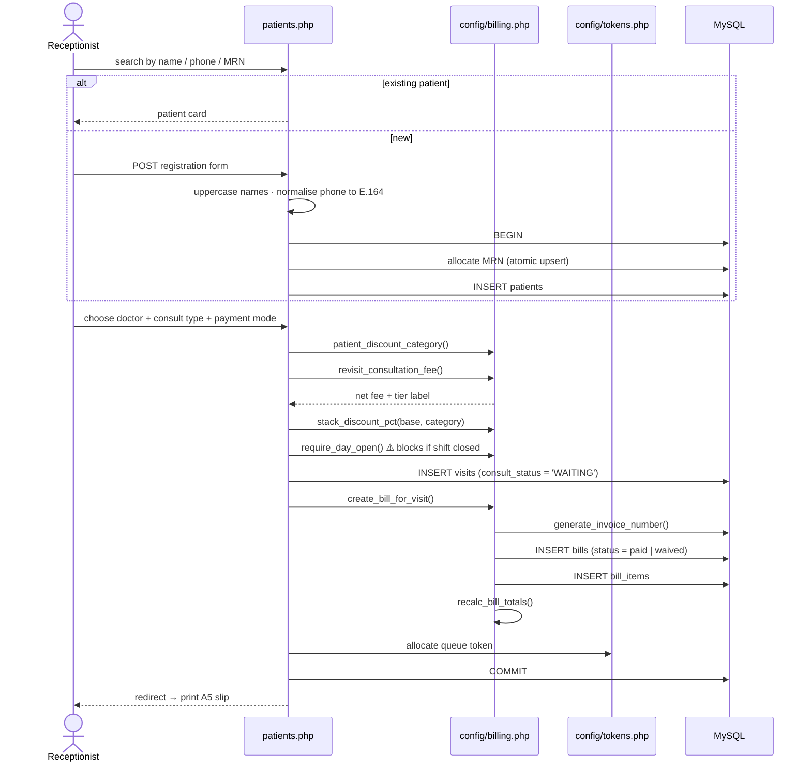
```mermaid
sequenceDiagram
    actor R as Receptionist
    participant P as patients.php
    participant B as config/billing.php
    participant T as config/tokens.php
    participant DB as MySQL

    R->>P: search by name / phone / MRN
    alt existing patient
        P-->>R: patient card
    else new
        R->>P: POST registration form
        P->>P: uppercase names · normalise phone to E.164
        P->>DB: BEGIN
        P->>DB: allocate MRN (atomic upsert)
        P->>DB: INSERT patients
    end

    R->>P: choose doctor + consult type + payment mode
    P->>B: patient_discount_category()
    P->>B: revisit_consultation_fee()
    B-->>P: net fee + tier label
    P->>B: stack_discount_pct(base, category)

    P->>B: require_day_open()  ⚠️ blocks if shift closed
    P->>DB: INSERT visits (consult_status = 'WAITING')
    P->>B: create_bill_for_visit()
    B->>DB: generate_invoice_number()
    B->>DB: INSERT bills (status = paid | waived)
    B->>DB: INSERT bill_items
    B->>B: recalc_bill_totals()
    P->>T: allocate queue token
    P->>DB: COMMIT

    P-->>R: redirect → print A5 slip
```

### Step 1 — Identify the patient

Reception searches by name, phone or MRN. An existing patient is reused — **the MRN is
permanent and never re-issued**.

### Step 2 — Register (new patients only)

Captured: full name, father/husband name, gender (`MALE`/`FEMALE`/`OTHER`), date of
birth or age, phone, CNIC, address, city.

**Two normalisations are mandatory:**

| Rule | Implementation |
|---|---|
| **ALL-CAPS names** | Uppercased **on save**; the input carries `class="uc"` so it uppercases as typed; uppercased again on every A5 print. |
| **E.164 phone** | Patient phones store as `+923001234567`. (Staff phones store local — different rule, see [§5](#5-authentication--session).) |

### Step 3 — MRN allocation

**Format: `YY` + `NNNN` + `MM`** — 8 digits, sequence zero-padded to 4, monthly reset.
The first patient of July 2026 is `26000107`.

> **Note the encoding differs from the invoice number.** Both carry `YY` and `MM`
> *inside* the number, but the MRN puts the sequence **in the middle, zero-padded to
> 4**, while an invoice number leads with an **unpadded** sequence (`1202607`). They are
> not interchangeable formats.

```php
$mrnStmt = $pdo->prepare('
    INSERT INTO mrn_counters (yr, mo, next_seq) VALUES (?, ?, 2)
    ON DUPLICATE KEY UPDATE next_seq = LAST_INSERT_ID(next_seq) + 1
');
$mrnStmt->execute([$year, $month]);
// Fresh (year, month) row (rowCount 1): month's first patient, seq = 1.
// Otherwise (rowCount 2): LAST_INSERT_ID captured the pre-increment seq.
$mrnSeq = $mrnStmt->rowCount() === 1 ? 1 : (int) $pdo->lastInsertId();
$mrn = substr((string) $year, 2, 2)
     . str_pad((string) $mrnSeq, 4, '0', STR_PAD_LEFT)
     . str_pad((string) $month, 2, '0', STR_PAD_LEFT);
$pdo->prepare('UPDATE patients SET mrn = ? WHERE id = ?')->execute([$mrn, $patientId]);
```

**Collision safety is structural, in two layers:**

1. **The NULL-MRN window.** `patients.mrn` is `VARCHAR(20) NULL UNIQUE` — deliberately
   nullable. MySQL permits *multiple* NULLs under a UNIQUE index, so the
   insert-then-derive-from-id pattern can briefly hold a NULL `mrn` without colliding
   with other concurrent inserts.
2. **The atomic counter**, serialised by row-locking on the `(yr, mo)` primary key.

Legacy MRNs (`HMS-00001`) are left untouched; search matches with `LIKE` so both formats
stay findable.

### Step 4 — Resolve the fee

1. `patient_discount_category()` — does this patient hold a standing discount category?
2. `revisit_consultation_fee()` — new visit, or a follow-up tier? ([§11](#11-flow-b--revisit-billing-engine))
3. `stack_discount_pct()` — combine the base discount with the category discount.

### Step 5 — Day-lock check

```php
require_day_open($pdo);   // ⚠️ MUST run before create_bill_for_visit()
```

Once a shift is closed for a business day, **no new paid bill may land on the signed
tally**. Registration is refused with a clear message.

### Step 6 — Create the visit

```sql
INSERT INTO visits (patient_id, doctor_id, consult_type_id, consult_status, …)
VALUES (…, 'WAITING', …)
```

`visits.consult_status` — `ENUM('WAITING','IN_CONSULT','DONE') DEFAULT 'WAITING'`,
alongside `started_at`.

### Step 7 — Create the settled bill

```php
function create_bill_for_visit(PDO $pdo, int $visitId, string $consultLabel, float $fee,
                               float $discountPct, int $userId, ?string $visitPaymentMode = null): int {
    $invoiceNumber = generate_invoice_number($pdo);

    // Reception picks CASH/DIGITAL at registration; this IS the confirmed method
    $paymentMethod = $visitPaymentMode === 'CASH' ? 'cash'
                   : ($visitPaymentMode === 'DIGITAL' ? 'card' : null);

    $consultFee = round($fee * (1 - ($discountPct / 100)), 2);
    $status = $consultFee > 0 ? 'paid' : 'waived';   // zero net fee = free visit

    // paid_by_id owns the money on the collector's shift tally.
    // Fallback INSERT keeps registration working mid-deploy if the column is absent.
    try {
        $pdo->prepare('INSERT INTO bills (invoice_number, visit_id, sales_tax_percent,
            consolidation_rate_percent, payment_method, status, paid_amount, paid_at,
            paid_by_id, created_by_id) VALUES (?, ?, 0, 0, ?, ?, ?, NOW(), ?, ?)')
            ->execute([$invoiceNumber, $visitId, $paymentMethod, $status, $consultFee, $userId, $userId]);
    } catch (PDOException $e) {
        // pre-per-user-closings shape
    }
    $billId = (int) $pdo->lastInsertId();

    $pdo->prepare('INSERT INTO bill_items (bill_id, description, quantity, unit_rate, amount)
                   VALUES (?, ?, 1, ?, ?)')->execute([$billId, $consultLabel, $consultFee, $consultFee]);

    recalc_bill_totals($pdo, $billId);
    return $billId;
}
```

**`bills.status` — `ENUM('draft','finalized','paid','waived')`:**

| Status | Meaning | Cash tally |
|---|---|---|
| `paid` | Money collected, `paid_amount = grand_total` | ✅ counted |
| `waived` | Genuinely free (Rs 0 follow-up / 100 % discount) | ❌ **excluded** |
| `finalized` | Partially settled, awaiting write-off approval | partial |
| `draft` | Legacy — no longer produced at registration | ❌ |

> **`waived` is a distinct state, not `paid` with amount 0** — so the closing slip and
> daily summary don't count free visits as phantom Rs 0 transactions. A waived visit
> still gets a token, still appears in the doctor's queue, and still consumes the
> free-visit allowance.

**Invoices carry NO tax.** `recalc_bill_totals()` writes `sales_tax_*` and
`consolidation_*` as zero — the columns are retained only so historical bills keep their
shape. Tax is withheld from the **doctor's share** instead, never added to the patient's
bill.

### Step 8 — Token & print

A queue token is allocated (`config/tokens.php`, per doctor per day), then the A5 slip
prints via `views/invoice_print_partial.php`.

### Step 9 — Consultation

`doctor.php` is the console/launchpad; `my_queue.php` is the work queue, **ordered by
token, not by consultation status**. The doctor moves the visit
`WAITING → IN_CONSULT → DONE`, recording private consultation notes
(`config/consultation_notes.php`, gated by `CLINICAL_VIEW_CONSULTATION_NOTES`).

### Step 10 — Disposition

From the consultation the patient may be sent home, or routed to a procedure
([§17](#17-flow-h--procedure-billing)), an admission ([§13](#13-flow-d--admission-day-care--observation)),
IPD ([§14](#14-flow-e--ipd-in-door)), or a dental plan ([§20](#20-flow-k--dental-module)).

### Double-submit protection

Two layers: a **global client-side lock** in `partials/head.php` disables the submit
button on first click, and a server-side `same_day_visit()` **idempotency** check
prevents a duplicate visit for the same patient + doctor + day.

---

## 11. Flow B — Revisit Billing Engine

`revisit_consultation_fee(PDO $pdo, int $patientId, int $doctorId, int $consultTypeId, float $fullFee)`

A follow-up within a configured window is charged at a reduced tier — or free. The
decision is made per **patient + doctor + consult-type** triple, measured from the last
**FULL-paid** consultation.

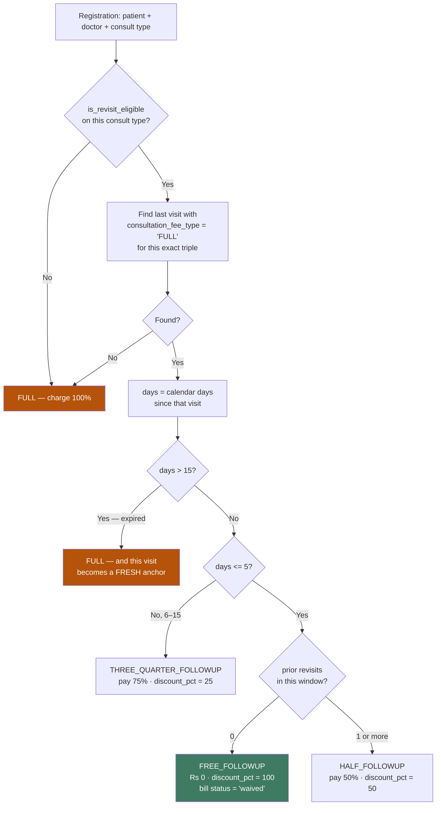
```mermaid
flowchart TD
    A[Registration: patient + doctor + consult type] --> EL{is_revisit_eligible<br/>on this consult type?}
    EL -->|No| FULL["FULL — charge 100%"]
    EL -->|Yes| B["Find last visit with<br/>consultation_fee_type = 'FULL'<br/>for this exact triple"]
    B --> C{Found?}
    C -->|No| FULL
    C -->|Yes| D["days = calendar days<br/>since that visit"]
    D --> E{days > 15?}
    E -->|Yes — expired| FULL2["FULL — and this visit<br/>becomes a FRESH anchor"]
    E -->|No| F{days <= 5?}
    F -->|No, 6–15| TQ["THREE_QUARTER_FOLLOWUP<br/>pay 75% · discount_pct = 25"]
    F -->|Yes| G{prior revisits<br/>in this window?}
    G -->|0| FREE["FREE_FOLLOWUP<br/>Rs 0 · discount_pct = 100<br/>bill status = 'waived'"]
    G -->|1 or more| HALF["HALF_FOLLOWUP<br/>pay 50% · discount_pct = 50"]

    style FREE fill:#3F7A63,color:#fff
    style FULL fill:#B45309,color:#fff
    style FULL2 fill:#B45309,color:#fff
```

**Tier vocabulary —
`ENUM('FULL','FREE_FOLLOWUP','HALF_FOLLOWUP','THREE_QUARTER_FOLLOWUP')`, nullable**

| Window | Condition | Patient pays | `discount_pct` | `fee_type` |
|---|---|---|---|---|
| ≤ 5 days | first follow-up | **Rs 0** | `100.0` | `FREE_FOLLOWUP` |
| ≤ 5 days | 2ⁿᵈ or later | **50 %** | `50.0` | `HALF_FOLLOWUP` |
| 6–15 days | — | **75 %** | `25.0` | `THREE_QUARTER_FOLLOWUP` |
| > 15 days | window expired | **100 %** | `0.0` | `FULL` |

> **⚠️ Mind the naming.** `THREE_QUARTER_FOLLOWUP` means the patient **pays** 75 %, so
> `discount_pct` is **25**. `HALF_FOLLOWUP` means pay 50 %, discount 50. The tier name
> describes the *fraction charged*, the column stores the *discount*.

**Step 1 — the eligibility gate.** Before anything else:

```php
SELECT is_revisit_eligible FROM doctor_consult_types WHERE id = ? AND doctor_id = ?
```

Admin unticks this for procedure-like consult types, which then always bill FULL. Default
is `1`, so existing types keep working.

**Step 2 — the anchor.** The lookup keys on the **visit's own pricing**, not on whether
money cleared:

```sql
SELECT id, visit_date FROM visits
WHERE patient_id = ? AND doctor_id = ? AND doctor_consult_type_id = ?
  AND consultation_fee_type = 'FULL'
ORDER BY visit_date DESC, id DESC LIMIT 1
```

**Why the anchor must be a FULL visit:** if it were simply the *last* visit, a chain of
free follow-ups would keep re-arming itself — each free visit resetting the clock. The
free window is therefore measured from a full-price consultation, and consumed rather
than renewed.

This is also why a **discounted new registration writes `NULL`**, not `'FULL'`
(`patients.php`): a discounted first visit is not a clean anchor. Only a brand-new
patient's first visit *at full fee* becomes one.

**Step 3 — the prior-revisit count** decides free vs 50 %:

```sql
SELECT COUNT(*) FROM visits
WHERE patient_id = ? AND doctor_id = ? AND doctor_consult_type_id = ?
  AND id <> ?                                  -- exclude the anchor itself
  AND visit_date >= ? AND visit_date <= CURDATE()
  AND consultation_fee_type IN ('FREE_FOLLOWUP','HALF_FOLLOWUP','THREE_QUARTER_FOLLOWUP')
```

**Reception override.** Posting `override_full=1` replaces the quote wholesale with a
full-fee `FULL` result, sets `visits.fee_overridden = 1`, and **clears
`anchor_visit_id`** — the overridden visit records no link back.

Backfill: `UPDATE visits SET consultation_fee_type='FULL' WHERE consultation_fee_type IS
NULL AND discount_pct = 0` — only clean, undiscounted pre-migration visits became anchors.

---

## 12. Flow C — Discount Categories

A standing discount attached to a patient (staff family, charity, corporate panel…).
Seeded categories: **Family & Friends**, **Charity**, **Loyalty**, all at 0 %.

### Four independent rates per category

A category is not one percentage — it carries a **separate rate per revenue stream**, so
a charity patient can be free on consultation but charged for procedures:

| Column | Applies to |
|---|---|
| `consultation_pct` | OPD consultation fee |
| `er_services_pct` | ER service lines |
| `room_stay_pct` | Admission room/stay charge |
| `procedures_pct` | Procedure bills **and** dental package accounts |

`room_stay_pct` was added later (`add_room_stay_discount.sql`) to close a real gap: the
category previously applied to service lines only and never the room stay, "**so a 100 %
Charity patient still paid the full stay charge**."

### The stacking rule — they COMPOUND, they do not add

```php
function stack_discount_pct(float $basePct, float $categoryPct): float {
    $paid = (100 - $basePct) * (100 - $categoryPct) / 100;
    return round(min(100, max(0, 100 - $paid)), 2);
}
```

> **50 % revisit + 20 % category is a 60 % total discount, not 70 %.** The patient pays
> 50 % × 80 % = 40 % of list. Capped at 100 so a free follow-up stays exactly free.

**Order is fixed: the revisit engine prices first, the category applies on top of that
result.**

### Three columns, three jobs

`visits.discount_pct` stores the **TOTAL** (category + revisit + manual) and drives all
money and print. `category_discount_pct` and `category_discount_amount` are the
**reporting split** — the portion attributable to the category, **stored rather than
derived** so reporting needs no stacking math and the 100 %-free edge case stays exact.

### Three semantic rules worth knowing

1. **A reception override cancels only the follow-up portion** — the category discount
   survives it, because it is the patient's standing entitlement.
2. **A category-only discount is still a clean `FULL` anchor** for the revisit window —
   it is automatic policy, not ad-hoc pricing, so discounted regular patients keep
   qualifying for follow-up rates.
3. **Rates are snapshotted onto the visit**, so editing a category later never rewrites
   history. `patient_discount_category()` joins `ON dc.is_active = 1`, so an inactive
   category reads as unassigned — admin can pause one without touching patient rows.

> **⚠️ Asymmetry:** the category is applied on the **follow-up** path only. A brand-new
> patient cannot already hold a category, so `register_patient` never calls
> `patient_discount_category()` and the three columns take their defaults.

### Who can apply

**Assignment is admin-only, hard-coded** (`base_role !== 'ADMIN'` → 403) — not a
permission key. Catalogue management is likewise `guard_admin.php`-gated. Reception only
sees the badge. The separate *ad-hoc* discount at registration is capped per user by
`users.max_discount_pct`.

### How it prints — it doesn't

**The slip renders one unlabelled "Discount" column carrying the TOTAL**, with an em dash
when zero. The category **name is never printed**: a patient must not learn from their
receipt that they were flagged "Charity" or "Family & Friends". The name exists only for
month-end reporting (`discount_report.php`).

---

## 13. Flow D — Admission (Day-Care / Observation)

An **admission** is a short observation or day-care stay. It is **not** an IPD stay and
**not** an ER walk-in.

> **Key architectural fact:** an admission raises a **completely separate bill** in its
> own tables (`admission_bills` / `admission_bill_items`) with its own **"A" series**.
> The consultation `bills` table is **never touched**. A doctor advising admission after
> a paid OPD consultation creates a new, distinct document.

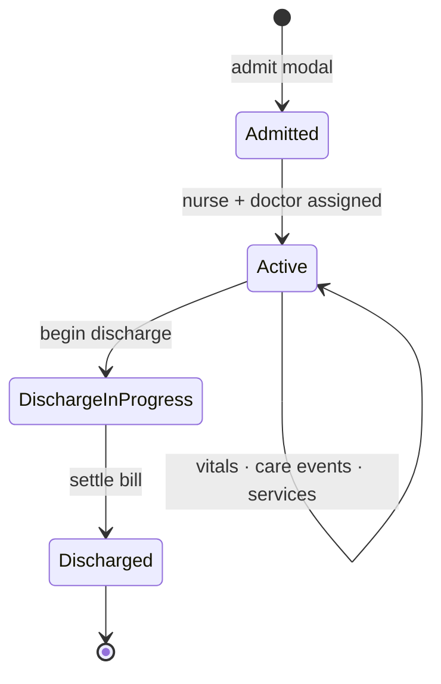
```mermaid
stateDiagram-v2
    [*] --> Admitted: admit modal
    Admitted --> Active: nurse + doctor assigned
    Active --> Active: vitals · care events · services
    Active --> DischargeInProgress: begin discharge
    DischargeInProgress --> Discharged: settle bill
    Discharged --> [*]
```

### Admit

`partials/admit_modal.php` captures the admission. **Two fields are mandatory:**

| Mandatory field | Rule |
|---|---|
| **Primary nurse** | Required at admit on **both** admission routes. |
| **Doctor** | Required at admit and on ER bills; defaults to the patient's last-seen doctor. Choosing **"Other"** reveals a free-text field. |

> **⚠️ The mandatory nurse is an accountability record only.** It must **never** gate
> vitals or service entry. Any nurse on shift can record care; the primary nurse field
> records *who owns* the patient, not *who may act*. The only thing reserved to them is
> handing the stay over.

**A "nurse" is a permission, not a base role** — the roster is computed from
`NURSING_ATTEND_SHORT_STAY` (admissions) or `IPD_RECORD_HANDOVER` (IPD), resolved in SQL
exactly as `load_permissions()` does, over `is_active = 1`. The posted id is re-checked
against that live roster server-side, because *"a POST can name any user id."*

If a roster is empty the route is **disabled in the UI** rather than failing on submit.

> **⚠️ A real submission bug worth knowing.** Both routes have a select named
> `assigned_nurse_id`, and the merged modal only *hides* the inactive one. **`hidden` does
> not stop submission** — PHP keeps the last duplicate, silently discarding the chosen
> nurse. The modal therefore **disables every control** in the inactive container.

**Doctor "Other" handling:** the sentinel `__OTHER__` option is **disabled on submit** so
it can never post as a doctor id. `resolve_doctor_pick()` returns a pair where **exactly
one side is non-null** — a real system doctor wins outright and blanks the free-text name;
a bogus id is treated as "not supplied" rather than trusted.

**Neither admission route creates a consultation bill.** If no visit exists, a *shell*
visit is created with `consult_status = 'DONE'` (keeping it out of the queue) carrying no
bill at all — so its fee never reaches any tally.

### During the stay

- **Vitals** — recorded by nursing (`add_admission_vitals.sql`; temperature stored in
  **Fahrenheit** after `rename_vitals_temp_to_fahrenheit.sql`).
- **Care events** — `add_admission_care_events.sql`, typed
  `ENUM('DOCTOR_VISIT','NURSING_CARE','MEDICATION','OBSERVATION','HANDOVER','SERVICE','OTHER')`.
- **Services** — each line priced by charge type:

```php
function admission_service_charge(string $chargeType, float $unitCharge,
                                  int $quantity, ?int $durationMinutes): float {
    if ($chargeType === 'HOURLY') { $hours = ($durationMinutes ?? 0) / 60;
                                    return round($unitCharge * $hours, 2); }
    return round($unitCharge * max(1, $quantity), 2);
}
```

`chargeType` is `ENUM('FLAT','HOURLY','PER_UNIT')`. **`FLAT` and `PER_UNIT` compute
identically** (`unit × qty`) — the distinction is catalogue semantics, not arithmetic.
Prices are always re-read from `er_services_master` (`status = 'ACTIVE'`), never taken
from the POST.

> **⚠️ The silent-zero trap.** An HOURLY service with no duration bills `rate × 0/60` =
> **Rs 0**. The IPD handler guards this explicitly ("Enter how many minutes for an hourly
> service"); **the admission handler has no such guard.**

### The stay clock — `admission_billed_hours()`

The room charge itself uses a different, deliberately generous rounding:

```php
//   0–44 completed minutes  -> 0.5 hour (flat half hour)
//   45 minutes and above    -> round DOWN to the previous quarter-hour
// e.g. 44->0.5, 45->0.75, 60->1.0, 100->1.5, 106->1.75.
function admission_billed_hours(int $minutes): float {
    if ($minutes < 45) { return 0.5; }
    return floor($minutes / 15) / 4;
}
```

A minimum half hour, then **rounding DOWN** to the previous quarter — the clinic never
bills a quarter-hour the patient did not complete. `LONG_PRIVATE` bills daily instead
(`ceil($mins / 1440)`, minimum 1). **This rounding applies to the stay only — never to
services.**

Service types include
`ENUM('INJECTION_IM','INJECTION_IV','IV_DRIP','OXYGEN','PROCEDURE','OTHER','SERVICE')`,
each able to carry a clinical note (`add_service_clinical_note.sql`).

### Discharge & settlement

`admission_discharge.php` assembles the final bill:

1. Sum all `admission_bill_items` → `recalc_admission_bill_totals()`
2. Apply the **manual discount** — a lump-sum **Rs** *or* a **%**
   (`add_admission_manual_discount.sql`)
3. Collect payment (Cash | Online / Card)
4. Set status — `paid`, or `finalized` if partially settled pending write-off approval
5. Print the A5 invoice (`admission_invoice.php`)

**The manual discount REPLACES the category discount.** `recalc_admission_bill_totals()`
adds the category discount back before subtracting the manual one, so the two never
compound; the category snapshot is retained for reporting but stops reducing the total.
A **percentage is converted to rupees on save and the rupee figure is authoritative** —
otherwise later line edits would silently re-scale the discount.

### Partial payment and the write-off

> A partial payment stamps **`paid_at` and `paid_by_id` even though the status stays
> `finalized`.** The cash is physically in the drawer *now*, so it must land on **this**
> shift. Without those stamps the money was invisible to `day_cash_tally()` until an admin
> approved the write-off — possibly days later — *"leaving the collector over at every
> close in between with no line explaining it."*

When the admin later approves:

```sql
paid_at    = COALESCE(paid_at, NOW()),
paid_by_id = COALESCE(paid_by_id, finalized_by_id, ?)
```

> **⚠️ `COALESCE`, never `NOW()`.** Overwriting the timestamp would **move the money to a
> second day** — short on the day it was collected, over on the day it was approved. The
> approval also runs `require_day_open()` against **the collector's** day, not the
> approver's.

Approval additionally rolls the shortfall onto the patient's `unpaid_*` counters — which
`void_admission_bill()` reverses, clamped with `GREATEST(0, …)` so a double-void cannot
drive them negative.

IPD differs: it writes the shortfall off **inline** when the settler holds
`IPD_APPROVE_WRITEOFF`, rather than using ER's two-step approval.

---

## 14. Flow E — IPD (In-Door)

A multi-day in-door stay in a **private room**. Status: **complete and live**.

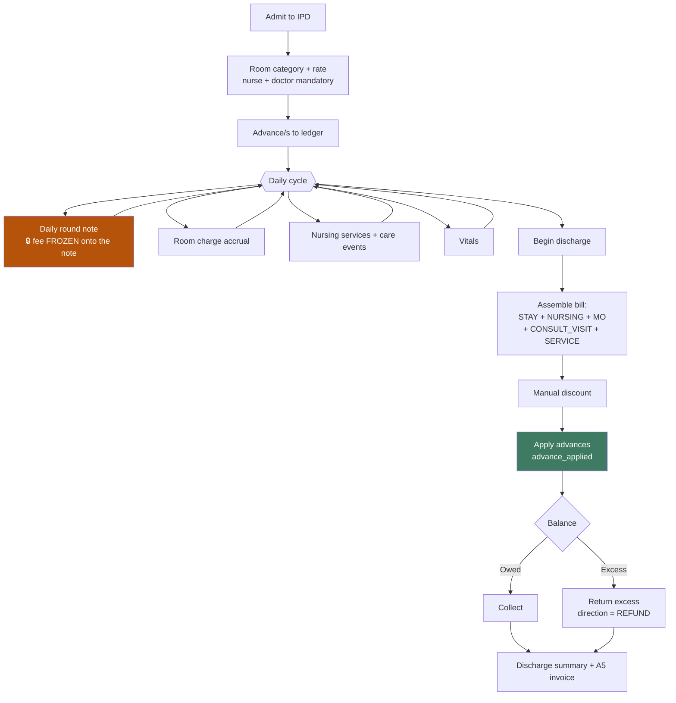
```mermaid
flowchart TD
    A[Admit to IPD] --> A1["Room category + rate<br/>nurse + doctor mandatory"]
    A1 --> ADV[Advance/s to ledger]

    ADV --> LOOP{{Daily cycle}}
    LOOP --> R1["Daily round note<br/>🔒 fee FROZEN onto the note"]
    LOOP --> R2[Room charge accrual]
    LOOP --> R3[Nursing services + care events]
    LOOP --> R4[Vitals]
    R1 & R2 & R3 & R4 --> LOOP

    LOOP --> D[Begin discharge]
    D --> BILL["Assemble bill:<br/>STAY + NURSING + MO<br/>+ CONSULT_VISIT + SERVICE"]
    BILL --> DISC[Manual discount]
    DISC --> APPLY["Apply advances<br/>advance_applied"]
    APPLY --> BAL{Balance}
    BAL -->|Owed| PAY[Collect]
    BAL -->|Excess| RET["Return excess<br/>direction = REFUND"]
    PAY & RET --> SUM[Discharge summary + A5 invoice]

    style R1 fill:#B45309,color:#fff
    style APPLY fill:#3F7A63,color:#fff
```

### Bill line types

`ipd_bill_items.item_type` — `ENUM('STAY','NURSING','MO','CONSULT_VISIT','SERVICE')`

| Type | Meaning |
|---|---|
| `STAY` | Room charge |
| `NURSING` | Per-day nursing charge (room category) |
| `MO` | Medical officer charge (room category) |
| `CONSULT_VISIT` | The consultant's daily round fee |
| `SERVICE` | Ad-hoc nursing services / procedures |

Room categories carry **four rates**: `per_day_rate`, `nursing_per_day_rate`,
`mo_per_day_rate` and `consultant_visit_fee` (`sql/ipd/add_ipd_room_charges.sql`).

### Day counting

```php
function ipd_stay_days(string $admittedAt, ?string $dischargedAt): int {
    $a = new DateTime(date('Y-m-d', strtotime($admittedAt)));
    $d = new DateTime(date('Y-m-d', strtotime($dischargedAt ?: 'now')));
    return max(1, (int) $a->diff($d)->days + 1);
}
```

**Calendar days, admit day = day 1, minimum 1.** Both endpoints truncate to `Y-m-d`
first, so time of day is irrelevant: **admit 23:50 and discharge 00:10 the next morning
bills 2 days.**

### A rate of zero writes NO line

```php
foreach ($perDay as [$kind, $label, $rate]) {
    if ($rate <= 0) { continue; }
    …
}
```

Deliberate: *"a bill listing 'Nursing charges … Rs 0' reads as though nursing were free,
when it means nobody set the rate."*

> **⚠️ The Rs 0 trap.** `ipd_room_rates` is matched on the category **NAME, not an FK** —
> so a category renamed or deleted out from under an in-flight admission returns nothing
> and **the whole stay silently prices at Rs 0.** This is why renaming a category
> cascades (`UPDATE ipd_admissions SET room_category = ?`) inside a transaction, and why
> changing rates automatically re-prices every still-open draft bill.

> **⚠️ Sort-order trap.** `FIELD()` returns 0 for an unlisted value, so `NURSING`/`MO`
> would sort **above everything**. Every `ORDER BY FIELD(item_kind, …)` must name all five
> kinds.

### The frozen daily-round fee — the most important IPD rule

> **A daily-round note is immutable, and the round fee is FROZEN onto the note at the
> moment it is written.**

`ipd_doctor_visits` rows carry a `visit_charge` **snapshot**. The first note of each
calendar day is flagged `is_paid = 1` and becomes the billable `CONSULT_VISIT` line.

**Why frozen:** an in-door patient's consultations *are* the consultant's income, and
they carry the same tax-first split as an OPD consult. Freezing the charge means
changing a doctor's rate tomorrow cannot silently rewrite last week's stay.

**The first note of each calendar day is the chargeable one**, decided inside the
transaction:

```php
$cnt = $pdo->prepare('SELECT COUNT(*) FROM ipd_doctor_visits
                      WHERE admission_id = ? AND DATE(visited_at) = CURDATE()');
$isPaid = ((int) $cnt->fetchColumn() === 0) ? 1 : 0;
```

A second visit the same day is clinically recorded but bills nothing.

**Carry-forward is three-tier**: the first round pre-fills from the admission's
`provisional_diagnosis`, every later round from the most recent note — **except
`progress`, which is never carried forward and must be chosen each round.**

**Minimum to save:** primary diagnosis, a progress value, and at least one of Clinical
Assessment or Management Plan.

> **⚠️ The consequence — a real incident.** For a period **every IPD bill charged Rs 0**,
> because every rate shipped seeded at `0.00` and nobody set them. Bills read *"Private
> room — 3 days Rs 0"* with no nursing and no MO charge at all.
>
> Those bills **cannot be retro-fixed**, and the mechanism is specific: the bill assembler
> reads the consultant total **from the notes, not the rate table** —
> `SUM(visit_charge) WHERE is_paid = 1` — precisely because each note froze the fee that
> applied the day it was written. So re-pricing a draft bill re-reads **the same zero
> snapshots**. Room, nursing and MO come back at the new rate; **consultant rounds do
> not.**
>
> The only repair is the manual per-line override — and even that is barred on `SERVICE`
> lines and on any non-draft bill. **Verify rates before the first admission of a new
> configuration.**

A `reprice` is refused outright once a bill is settled: money has changed hands and the
invoice may already be printed.

### Doctor earnings from IPD

`doctor_earned_for_month()` recognises IPD money when the **IPD bill is paid**, not when
the round was written — a round on the 28ᵗʰ that settles on the 2ⁿᵈ belongs to the month
the money arrived, matching the cash basis used everywhere. Because one bill covers a
whole stay, a doctor's rounds are attributed via their **own `visit_charge` rows**
rather than by splitting the bill total.

### Other IPD surfaces

| File | Purpose |
|---|---|
| `ipd_file.php` | Patient file — **nursing care record kept separate from the billing log** |
| `ipd_daily_round.php` | Write the immutable round note |
| `ipd_discharge_summary.php` | Clinical discharge summary |
| `ipd_stay_report.php` | Stay analytics |
| `ipd_admissions.php` | The in-door board, Current / Past tabs; settled discharges drop off |

---

## 15. Flow F — IPD Advances

Money taken **before** the stay is billed. `config/ipd_advances.php`,
`sql/ipd/add_ipd_advances.sql`.

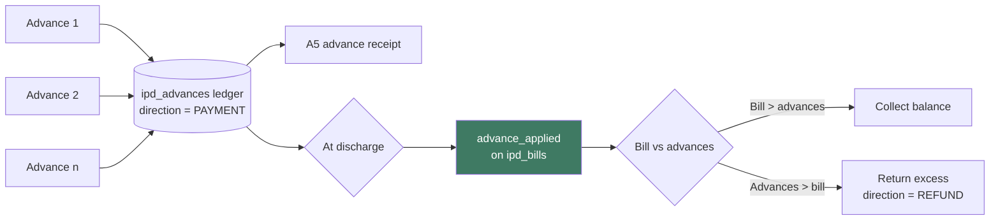
```mermaid
flowchart LR
    A1[Advance 1] --> L[(ipd_advances ledger<br/>direction = PAYMENT)]
    A2[Advance 2] --> L
    A3[Advance n] --> L
    L --> RCPT[A5 advance receipt]

    L --> DIS{At discharge}
    DIS --> APP["advance_applied<br/>on ipd_bills"]
    APP --> B{Bill vs advances}
    B -->|Bill > advances| PAY[Collect balance]
    B -->|Advances > bill| EXC["Return excess<br/>direction = REFUND"]

    style APP fill:#3F7A63,color:#fff
```

**Why a ledger and not a column on the bill** — three reasons, all structural:

1. Advances arrive **before `ipd_bills` exists** (that row is created at discharge).
2. There can be **many** per admission; `paid_amount` is a single settlement figure.
3. Each receipt needs its **own `paid_by_id`/`paid_at`** so it lands on the correct
   shift's cash tally the moment it is taken.

**Why `refunds` is not reused for the excess return:** `refunds.bill_id` is `NOT NULL`
with an FK to `bills` — the *consultation* bill table — so an IPD advance refund cannot
be represented there at all.

### The sign convention

`direction` is `ENUM('PAYMENT','REFUND')` and **both are stored positive** — the direction
carries the sign, *"so `SUM()` needs a CASE and can never be mis-signed by an accidental
negative amount."*

```sql
SELECT COALESCE(SUM(CASE WHEN direction = 'REFUND' THEN -amount ELSE amount END), 0)
FROM ipd_advances WHERE admission_id = ? AND voided_at IS NULL
```

### Rules

- **Series `ADV-YYYY-NNNN`** — yearly, not monthly, and generated under a `FOR UPDATE`
  row lock (unlike the bill series).
- Taking an advance runs `require_day_open()` **first** and is refused once the stay is
  `DISCHARGED` — the discharge bill has settled and the receipt would never be applied to
  anything. Both use **PRG**, so a refresh cannot take the same advance twice.
- **Voiding** is admin-only, needs a reason, and is likewise refused after discharge:
  the bill has already settled against this ledger, so voiding underneath it would
  silently unbalance a closed account.
- Advances and returns are **kept apart, not netted**, on the closing sheet: a day with
  both must show both, not one small net figure.
- The excess return is written **after the bill commits** — it is its own ledger row, and
  a failure there must not roll back a settled discharge. If it fails, the UI says so
  explicitly rather than swallowing it: *"The bill was settled and the patient
  discharged, but the advance return could NOT be recorded… Hand the money back and
  record it manually."*
- `ipd_advance_receipt.php` prints the A5 receipt; doctors are 403'd from it (**doctors
  never handle cash**), and a voided receipt prints a rotated `VOID` watermark.

> **⚠️ The double-count trap.** A bill's `paid_amount` that includes ledger money **must
> be netted** in the tally — this is exactly why `day_cash_tally()` computes
> `paid_amount − advance_applied` for IPD ([§8.5](#85-day_cash_tally--the-full-bucket-list)).

---

## 16. Flow G — ER Walk-In Bill

A **prepaid walk-in service bill**, "E" series. **It is not an admission.**

- `er_bill.php` raises it; `er_services.php` manages the service catalogue.
- **A doctor is mandatory** on ER bills (`add_er_bill_doctor.sql`).
- ER short-stay gives nursing an **un-billed care flow-sheet** — clinical observation
  recorded without generating charges.
- In the tally, ER keeps its **own** `cash_er_`/`online_er_` keys for the live Day
  Closing page *and* folds into the admission buckets so the stored columns and printed
  A5 slip pick it up with no schema change.

---

## 17. Flow H — Procedure Billing

**Live since 2026-07-27.** "P" series, `procedure_bills` / `procedure_bill_items`.

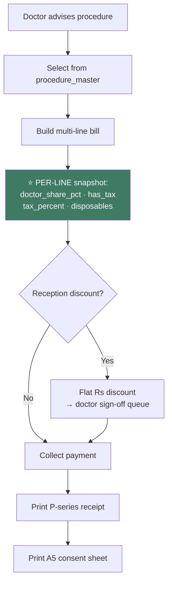
```mermaid
flowchart TD
    A[Doctor advises procedure] --> B[Select from procedure_master]
    B --> C[Build multi-line bill]
    C --> D["⭐ PER-LINE snapshot:<br/>doctor_share_pct · has_tax<br/>tax_percent · disposables"]
    D --> E{Reception discount?}
    E -->|Yes| F["Flat Rs discount<br/>→ doctor sign-off queue"]
    E -->|No| G[Collect payment]
    F --> G
    G --> H[Print P-series receipt]
    H --> I[Print A5 consent sheet]

    style D fill:#3F7A63,color:#fff
```

### The per-line snapshot — critical

> **Procedure share is snapshotted per LINE, and does NOT go through `doctor_split()` on
> an aggregate.**

Unlike consultations (one share rate per doctor), each procedure carries its **own**
share percentage. So every `procedure_bill_items` row stores its own
`doctor_share_pct`, `has_tax`, `tax_percent` and `disposables` at the moment of sale.
Earnings are summed **line by line** via `doctor_split_sql()` over the **item** columns:

```php
function doctor_procedure_earnings(PDO $pdo, int $doctorId, string $from, string $toExcl): array
```

It returns `['gross','disposables','tax','doctor','clinic','clinic_net','bills','live']`.
The **`live`** flag is `false` when the tables don't exist yet, letting callers show
"not billed yet" instead of a misleading **zero** — a genuinely different statement.

### ⭐ The line spread — one ratio, residue on the last line

Both discounts (category, then manual) collapse into **ONE ratio computed before the
loop**, and the rounding residue is carried and settled on the final line:

```php
$lineRatio = $subtotal > 0 ? ($grandTotal / $subtotal) : 0.0;
$spreadRemaining = $grandTotal;
$lastIndex = count($lines) - 1;
foreach ($lines as $lnIdx => $ln) {
    $lineAmount = $lnIdx === $lastIndex
        ? round($spreadRemaining, 2)                    // settle the residue exactly
        : round($ln['amount'] * $lineRatio, 2);
    $spreadRemaining = round($spreadRemaining - $lineAmount, 2);
    $lineDisp = min($lineAmount, (float) ($ln['disp'] ?? 0));   // re-clamp
}
```

**Why one ratio and not two sequential discounts:** applying them in sequence would round
twice per line and drift `SUM(amount)` away from `grand_total` by a paisa or two.

> **That invariant is load-bearing.** Doctor share is computed **per line**, so any drift
> puts the share statement and the P&L quietly at odds with the drawer. The residue is
> settled on the last line so the sum is **exact, not merely close**.

**Disposables are not discounted** — the clinic paid the same for them whoever the patient
is — but they are **re-clamped** to the discounted line amount, because a discount can
drop a line below its own supply cost.

### The consent gate splits on where consent lives

```php
if (empty($ln['consent'])) continue;                                  // not flagged
if (consent_template_for($pdo, $ln['master_id']) !== null) continue;  // prints here
if (!dental_consent_satisfied(...)) { $error = …; }                   // must be signed first
```

The gate originally demanded an already-**SIGNED** consent — and a consent only becomes
SIGNED when its scan is uploaded. That works for dentistry (consent captured days earlier
at treatment planning) but **cannot** work for a walk-in: the patient is at the desk, the
sheet prints with the receipt, and it is signed on the spot. **Requiring a signed scan
first made any procedure with a consent template permanently unbillable.**

So: *has a template* → nothing to wait for, it prints in a moment. *Flagged with no
template* → the consent lives elsewhere and the signed-first rule still stands.

A bill is raised in **one transaction**, born settled (`paid`, or `waived` when the total
is zero) — there is no draft state. **Consents are created inside that transaction**: a
consent must never survive a bill that rolled back, and a bill must never commit having
failed to record the consent it is about to print. Sheet push and the discount
notification fire **after** commit, each wrapped so neither can cost the clinic the bill.

### Disposables

Supply cost is **recovered off the top** before tax and before the split
([§8.1](#81-the-doctor-split--tax-first) step 1). The recovered cost belongs to the
**clinic**. `procedure_disposables_column()` and `procedure_disposables_flag()` guard
whether the feature is live.

`procedure_master.php` (admin, `ADMIN_MANAGE_PROCEDURE_MASTER`) defines procedures,
prices, per-procedure share %, tax and disposables.

---

## 18. Flow I — Procedure Discount & Doctor Sign-Off

A reception-applied **flat Rs** discount on a procedure, reviewed by the doctor
afterwards.

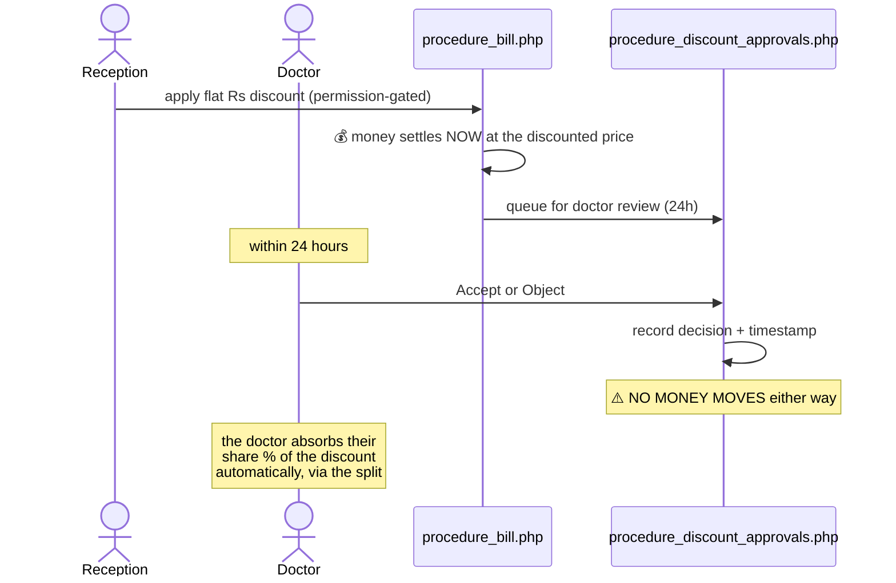
```mermaid
sequenceDiagram
    actor R as Reception
    actor D as Doctor
    participant PB as procedure_bill.php
    participant AP as procedure_discount_approvals.php

    R->>PB: apply flat Rs discount (permission-gated)
    PB->>PB: 💰 money settles NOW at the discounted price
    PB->>AP: queue for doctor review (24h)

    Note over D: within 24 hours
    D->>AP: Accept or Object
    AP->>AP: record decision + timestamp
    Note over AP: ⚠️ NO MONEY MOVES either way

    Note over D: the doctor absorbs their<br/>share % of the discount<br/>automatically, via the split
```

> **The rule that surprises everyone: the doctor's decision moves NO money.**

### Why rupees, never a percentage

The discount is a **flat Rs amount**, deliberately: *"the admission manual discount
learned this the hard way. A stored % silently re-scales itself if the bill's lines are
ever edited afterwards. The rupee figure is authoritative."*

Reception's `manual_discount` is **forced to zero server-side** without
`RECEPTION_APPLY_PROCEDURE_DISCOUNT`, regardless of what was posted. It **stacks on** the
category discount and is clamped to what remains, so a bill can never go negative.

### ⭐ The exact mechanism by which the doctor absorbs it

**What moves the money is the billing INSERT, not the decision.** The chain:

1. `$grandTotal = $afterCategory − $manualDiscount`
2. The line loop spreads that reduced total: `$lineRatio = $grandTotal / $subtotal`
3. `procedure_bill_items.amount` therefore stores the **discounted** figure
4. `doctor_procedure_earnings()` splits `i.amount` — the discounted figure — at
   `i.doctor_share_pct`

**⇒ The doctor absorbs their share % of the discount at the moment the bill is raised,
automatically, with no further action by anyone.**

> Rs 10,000 line, 60 % share. List → doctor Rs 6,000. Reception gives Rs 2,000 off → line
> amount Rs 8,000 → doctor Rs 4,800. **The doctor absorbed Rs 1,200 = 60 % of the
> Rs 2,000**; the clinic absorbed Rs 800.

### Why a decision *cannot* move money

Two hard constraints:

1. **A procedure bill cannot be refunded** — `refunds.bill_id` is FK'd to the OPD `bills`
   table.
2. **A void is refused once the cashier's day is signed** — which, inside a 24-hour
   window, is the normal case, not an edge case.

So `REJECTED` is *"an objection on the record"* — the ENUM column's own comment. **The
button therefore reads "Object", not "Reject"**: a button must not promise a reversal the
system will never perform.

A useful consequence: because no decision moves money, **none of the money reads need a
"pending" concept.** `day_cash_tally()`, `clinic_revenue()` and the closing sheet all sum
`paid_amount`, which is final the moment the bill is raised.

### The headline figure the doctor actually sees

The approval screen splits each line **twice** and shows the gap — the doctor's own
exposure, rendered larger than the discount itself "because it is the number they are
actually being asked about":

```php
$actual = doctor_split($ln['amount'], …);                       // discounted
$list   = doctor_split($ln['unit_rate'] * $ln['quantity'], …);  // list price
$loss  += ($list['doctor'] - $actual['doctor']);
```

### The 24-hour clock and the sweep

`discount_notified_at` is stamped **at billing time, not when the doctor opens the app** —
the clock must run for a doctor who never logs in.

Status: `ENUM('NONE','PENDING','APPROVED','REJECTED','AUTO_APPROVED')`. **`NONE` is the
default**, so every historical row and every bill without a discount is unambiguously
"nothing to decide" rather than sitting in the queue forever.

```sql
UPDATE procedure_bills
   SET discount_approval = 'AUTO_APPROVED', discount_decided_at = NOW()
 WHERE discount_approval = 'PENDING'
   AND discount_notified_at IS NOT NULL
   AND discount_notified_at < (NOW() - INTERVAL 24 HOUR)
```

**`AUTO_APPROVED`, never `APPROVED`** — *"'the doctor agreed' and 'the doctor never
looked' are different facts, and the admin report exists to tell them apart."*
`discount_decided_by_id` stays NULL for the same reason: nobody decided.

The decision UPDATE carries `AND discount_approval = 'PENDING'`, which is what makes a
double-submit safe — the second matches zero rows rather than overwriting the first
answer. A non-admin's UPDATE also carries `AND discount_doctor_id = ?`.

> **⚠️ Why the sweep lives inside `cron/daily_summary.php` rather than its own file:**
> *"Several HIMS crons have been written and never registered in hPanel; this one is at
> least safe when that happens."* **`daily_summary.php` is the one cron confirmed
> registered and running.** The sweep is also self-healing — it catches *everything* past
> the window, so a missed night catches up on the next run.

Gated by `DOCTOR_APPROVE_PROCEDURE_DISCOUNT` (granted to DOCTOR **and** ADMIN explicitly,
not copied from another key — the admin needs the queue visible *because the admin report
is where the actual control lives*).

---

## 19. Flow J — Consent

`config/consent.php`, `procedure_consents.php`, `procedure_consent_template.php`.

### The template is the switch, not the flag

`consent_template_for()` returns the **trimmed** template or `null`. A procedure can be
flagged `mandatory_consent` while its wording is still being written, and *"printing a
blank sheet under a 'CONSENT FOR …' heading is worse than printing none."*

The two are kept from drifting the other way by the template editor: **writing a
non-empty template forces `mandatory_consent = 1`** — an admin who writes wording and
leaves the flag off would get a consent that prints but never gates.

### ⭐ The freeze — and why unfilled signer placeholders must survive it

`consent_render()` has **two output modes**, and the difference is the whole mechanism:

| Mode | Used for | Unknown placeholder becomes |
|---|---|---|
| `$forPrint = false` | **the frozen `consent_text` stored on the row** | `''` — *except signer keys* |
| `$forPrint = true` | **print only, never stored** | a ruled `<span class="blank">` to write on |

```php
$signerKeys = ['{{signer_name}}', '{{signer_relation}}', '{{signer_cnic}}'];
if ($isSigner && $raw === '') { continue; }   // leave the placeholder STANDING
```

The patient's name, the doctor and the procedure are all known when the bill is raised, so
they are substituted and frozen. **The signer usually is not.** Substituting an empty
signer to `''` at freeze time would destroy the only marker of *where on the sheet that
rule belongs*, and the sheet would print `I, ,  of the child …` **with nothing to sign
on**.

The frozen text carries **no print markup on purpose** — the row must stay readable in a
database client, an export and an audit trail, and a stored blob of `<span class="blank">`
would be none of those.

On reprint, the second render pass is given **only the three signer variables** — the ones
already baked into the frozen text — so **it cannot reintroduce a value that was not there
at signing.**

### The sheet

**One A5 consent sheet prints immediately after the receipt**, appended as further pages
of the *same* document so the whole set comes out of one print action.

- **ONE copy, not two.** It printed a clinic copy and a patient copy until the clinic
  asked for one: the sheet that gets signed is the record and stays in the file; the
  patient keeps the receipt.
- **A5, not A4** — the receipt is its own sheet here, which frees the consent to match
  every other document the clinic prints: one paper size in the drawer, one tray.
- **No DUPLICATE watermark on the consent**, unlike the receipt. A reprinted *receipt* is
  marked DUPLICATE so it cannot be presented as proof of a second payment — but **a
  consent is a form that gets signed, and every copy of it is meant to be signable.
  Stamping DUPLICATE would cast doubt on a signature the clinic needs to rely on.** This
  is exactly why the receipt's watermark is scoped inside its own sheet rather than
  page-fixed.
- A reprint reprints the consent too, deliberately — the signed copy gets lost.

### Signer details

**CNIC is `VARCHAR(15)`, not an integer** — a CNIC is written `00000-0000000-0`, is never
arithmetic, and has leading digits that matter. It is **nullable** because the cashier
usually does not have it in hand when the bill is raised; a `NOT NULL` column would force
them to invent a value. A half-typed CNIC is stored **as typed** rather than silently
mangled into a well-formed but wrong number.

**Relation is free text.** It was previously validated against a fixed list and silently
blanked when it did not match — so a real answer the list did not anticipate ("UNCLE",
"GRANDFATHER") vanished without a word and the sheet printed an empty rule. The list
survives only as a datalist suggestion.

Status: `ENUM('PENDING','SIGNED')` — **nothing marks a consent signed just because it
printed.** An uploaded scan *is* the signature in this version; there is no signature pad.

Permissions: `RECEPTION_MANAGE_CONSENT`, `RECEPTION_PRINT_CONSENT`,
`RECEPTION_UPLOAD_CONSENT`.

> **Naming note:** consents live in a table called **`dental_consents`**, but it is
> generic in every column that matters and stores procedure consents too. Renaming it
> would mean touching six files in one migration with a live billing gate depending on
> each — *"the rename buys nothing a comment cannot."*

> **⚠️ SQL gotcha for verification scripts:** in a verify `UNION` that has an
> `information_schema` branch, **fully qualify app tables in the other branches** or
> MySQL raises **#1109 (unknown table)**.

---

## 20. Flow K — Dental Module

A full clinic-within-the-clinic. **All three migrations applied and verified
2026-07-28.**

| Surface | File |
|---|---|
| Tooth chart & treatment plan | `dental_treatment.php` |
| Package accounts (list) | `dental_accounts.php` |
| Package account (detail, payments) | `dental_account.php` |
| Consent | `dental_consent.php`, `dental_consent_file.php` |
| Lab work | `dental_lab.php` |
| Engine | `config/dental.php` |

### The design in one sentence

Dental reuses registration, the consultation fee, the P-series procedure bill and the
doctor-share config **unchanged**. It breaks the app's assumptions in exactly **one**
place: *a crown or an ortho case is quoted once and paid across many visits.*

### The two money paths

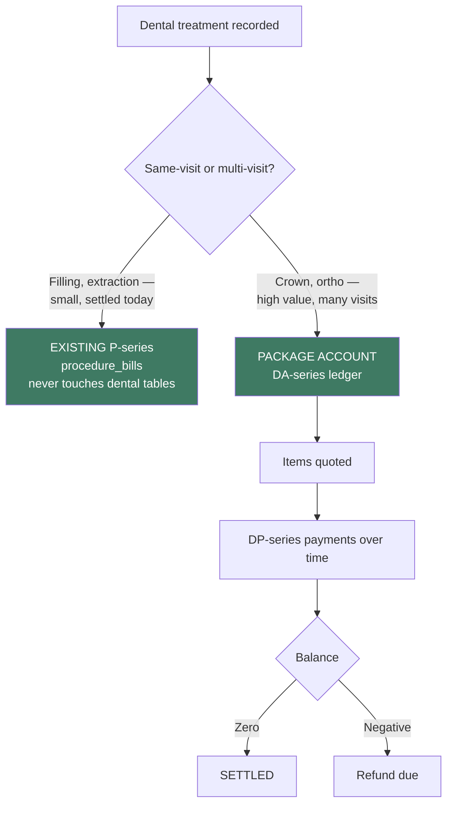
```mermaid
flowchart TD
    T[Dental treatment recorded] --> Q{Same-visit or multi-visit?}
    Q -->|"Filling, extraction —<br/>small, settled today"| P["EXISTING P-series<br/>procedure_bills<br/>never touches dental tables"]
    Q -->|"Crown, ortho —<br/>high value, many visits"| A["PACKAGE ACCOUNT<br/>DA-series ledger"]
    A --> A1[Items quoted]
    A1 --> A2[DP-series payments over time]
    A2 --> A3{Balance}
    A3 -->|Zero| S[SETTLED]
    A3 -->|Negative| R[Refund due]

    style P fill:#3F7A63,color:#fff
    style A fill:#3F7A63,color:#fff
```

> **Opening an account does NOT raise a `procedure_bill`.** The money is tracked by the
> ledger instead, because a prepaid one-shot bill cannot represent *"Rs 90,000 quoted,
> Rs 20,000 paid"*. After saving a treatment the dentist picks **"Bill this now"** or
> **"Add to a package"** — that choice is the whole design of the module.

### ⭐ The no-total rule

**`dental_procedure_accounts` has no total column, deliberately.**

> A stored total is a second source of truth that drifts the first time someone voids a
> crown and the recompute is missed — and on a package the patient signed a figure for, a
> drifted total is a **dispute**. The items *are* the quote; the quote explains itself.

`dental_account_totals()` is the **single definition** of what an account is worth — one
query, five correlated subqueries:

```
charged  = SUM(items.amount)      WHERE voided_at IS NULL
lab      = SUM(items.lab_charge)  WHERE voided_at IS NULL
paid     = SUM(payments.amount)   WHERE status='paid' AND voided_at IS NULL
total    = charged + lab
balance  = total - paid           -- NEGATIVE means overpaid → "REFUND DUE"
```

> The account **list** page re-implements this as one query with two derived joins to
> avoid N+1. The definitions mirror each other exactly — **if either changes, change
> both.**

### Series and parsing

- **`DA`** — account · **`DP`** — payment receipt. DP needs its own series precisely
  because one account produces **N** receipts.
- Both are **2-character prefixes** → `SUBSTRING(number, 3, CHAR_LENGTH(number) - 6)`.

> **⚠️ Copying the 1-char parse here silently breaks the series.** `SUBSTRING(n, 2, len-5)`
> on `DA12607` leaves `"A1"`, and **`CAST('A1' AS UNSIGNED)` is 0** — so the counter
> restarts at 1 every call and the UNIQUE key throws on the month's second account. The
> migration's verify block tests exactly this: expect `DA1…, DA2…`, **not two `DA1…`**.

### Payments — a different shape

`dental_procedure_payments` has **no `paid_amount` column** — the row **is** the money,
so every reader sums **`amount`**. Status is `'paid'|'voided'` only: **there is no waived
payment** — waiving happens by **voiding items**, which lowers what is owed.

`paid_by_id` **is the drawer** — the person whose till the cash went into, not whoever
clicked. Taking a payment runs `require_day_open()` **first**.

### Account lifecycle — `ENUM('OPEN','SETTLED','CANCELLED')`

- **Settle** is refused while a balance remains.
- **Cancel** freezes the balance by **refusing further writes**, not by storing a
  snapshot — that is how it stops moving without breaking the no-total rule. An
  overpayment surfaces as **REFUND DUE** and is named **in the audit trail**, because a
  refund raised by hand needs a record saying why.

> **Documentation discrepancy:** the migration's prose comment calls the middle state
> `COMPLETED`, but the DDL declares **`SETTLED`** and all code uses it. `SETTLED` is
> authoritative.

### Void asymmetry

- **Voiding an item takes NO day lock** — an item is a *quote line, not cash*. Voiding
  lowers what is owed; it touches no signed day's tally.
- **Voiding a payment DOES**, against the **original drawer and date**, never today's.

### Tooth charting — FDI, an allow-list not a regex

`fdi_teeth()` enumerates the **52 legal codes** (permanent 11-18/21-28/31-38/41-48,
primary 51-55/61-65/71-75/81-85 — children have no premolars or third molars).

> **An explicit allow-list, not a regex, on purpose:** every plausible pattern
> (`/^[1-8][1-8]$/` and friends) also admits 19, 29, 56 and 86, none of which are teeth.
> **A mis-read tooth number is a medico-legal error, not a cosmetic one — the wrong tooth
> gets drilled.**

Prior treatment records are **read-only**; only an admin can void one, with a reason, and
the void stays visible.

### Statement & receipt

The **receipt** shows the money **as at that receipt** (`WHERE id <= ?`), not from the
live account — so a reprint months later still shows what the patient was told at the
time. The **statement** prints Lab as its own column and its own line, **never folded
into the treatment total**.

### Dental lab

Lab orders move one direction only: **`SENT → RECEIVED → FITTED`**, each step stamping
its own date column. Any other transition is refused — "letting a FITTED crown go back to
SENT would make the dates meaningless; a correction is a void and a re-log, not a
rewind." An overdue list falls straight out of `status='SENT' AND expected_date < CURDATE()`.

**Two different `lab_charge` columns — do not conflate them:**

| Column | Meaning |
|---|---|
| `dental_lab_work.lab_charge` | what the **clinic pays the vendor** |
| `dental_procedure_account_items.lab_charge` | what the **patient pays** |

Usually equal, but not the same fact — a clinic that marks lab work up needs both, and
**only the second is ever billed**.

### ⚠️ Why the lab charge must NOT be passed as `$disposables`

This is the single most important correctness note in the dental module, and it is
counter-intuitive enough that it was caught only by a failing test.

**Disposables and lab are opposite shapes:**

- **Disposables** recover a cost *out of a fee the patient already paid* — Rs 3,000 fee
  with Rs 500 of sutures leaves Rs 2,500 divisible. The fee absorbs the cost.
- **Lab is billed to the patient ON TOP of the fee**, as its own visible line. The fee is
  already whole; **nothing needs recovering out of it.**

Routing lab through `$disposables` would deduct it from the procedure fee *as well as*
charging it to the patient — double-counting it, and **underpaying the dentist by their
share % of the lab on every crown.**

> *"A test caught exactly that: Rs 3,000 to the dentist where Rs 6,000 was owed."*

So the split runs on the **fee alone**, and the lab is added to the clinic's side as the
pass-through it is:

```
clinic = clinic_net + lab
```

`doctor_dental_earnings()` accordingly makes **only 4-argument `doctor_split_sql()`
calls** — no 5ᵗʰ disposables argument anywhere in the dental path.

> **⚠️ Two comments in the repo disagree on this.** The header of
> `sql/add_dental_module.sql` (written earlier) says lab is "passed as the `disposables`
> argument". **It is not, and must not be.** `config/dental.php` carries the authoritative
> correction with the failing-test citation, and the code follows the config.

### Proportional cash-basis recognition

A package is quoted once and paid over months, so "when was it earned?" has no single
answer. Paying a doctor's share on money the clinic has not collected is a real
cash-flow problem — so **each payment is apportioned across the account's live items in
proportion to their amount**, and each slice is split using **that item's own snapshot**.

> Rs 100,000 account — endo Rs 40,000 @ 70 %, prosthetic Rs 60,000 @ 50 %. The patient
> pays Rs 25,000 (25 %): endo recognises Rs 10,000 → doctor Rs 7,000; prosthetic
> recognises Rs 15,000 → doctor Rs 7,500. A single blended rate would be wrong — the same
> reason procedure lines snapshot per line.

**Branding:** print shows **BABY MEDICS** unless the doctor is a dentist, in which case
the dental identity (**SMILE RESORT**) is used. `config/brand.php` resolves this and is
require-able without any session or DB bootstrap, because print partials load it before
that bootstrap exists.

Permissions: `DENTAL_RECORD_TREATMENT`, `DENTAL_VIEW_ACCOUNTS`, `DENTAL_MANAGE_LAB_WORK`.

---

## 21. Flow L — Day / Shift Closing

`shift_closing.php` — **per-user** closing. Each staff member signs off **their own**
takings; there is no shared drawer.

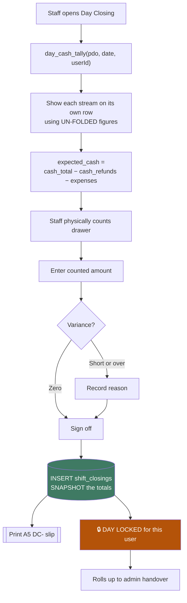
```mermaid
flowchart TD
    A[Staff opens Day Closing] --> B["day_cash_tally(pdo, date, userId)"]
    B --> C[Show each stream on its own row<br/>using UN-FOLDED figures]
    C --> D["expected_cash =<br/>cash_total − cash_refunds − expenses"]
    D --> E[Staff physically counts drawer]
    E --> F[Enter counted amount]
    F --> G{Variance?}
    G -->|Zero| H[Sign off]
    G -->|Short or over| I[Record reason] --> H
    H --> J[(INSERT shift_closings<br/>SNAPSHOT the totals)]
    J --> K[[Print A5 DC- slip]]
    J --> L[🔒 DAY LOCKED for this user]
    L --> M[Rolls up to admin handover]

    style L fill:#B45309,color:#fff
    style J fill:#3F7A63,color:#fff
```

### What the closing sheet shows

Each revenue stream gets its **own row**, using the **un-folded** figures from
[§3.3](#33-the-fold--un-fold-rule--why-money-is-never-double-counted):

```
Consultations              cash_consult_total
Admissions / Discharges    cash_admission_only_total   ← un-folded
Emergency (ER)             cash_er_total
Procedures                 cash_procedure_total
Dental                     cash_dental_total
IPD Advances               cash_advance_total
Advance Returns          − cash_advance_return_total
─────────────────────────────────────────────────
Cash total                 cash_total
Less cash refunds        − cash_refund_total
Less counter expenses    − expense_total
═════════════════════════════════════════════════
EXPECTED IN HAND           expected_cash
```

`opening_float()` reads `clinic_settings['opening_float']`, but note the tally comment:
**expected cash carries no float** — it is *personal accountability only*.

### Day lock

```php
function require_day_open(PDO $pdo, ?string $date = null, ?int $userId = null): ?string
```

Once signed, **no new paid bill may land on that date for that user**. Every
money-taking page calls this *before* writing. Registration, procedure billing, admission
settlement and IPD discharge all respect it.

### What the user actually declares — only three inputs

`counted_cash` (the physical count), `handover_declared` (cash passed to the admin,
prefilled `max(0, expected_cash)`), and `variance_note`. Plus which admin is receiving it.

```php
$variance = round($counted - $tally['expected_cash'], 2);
```

> **Sign convention: negative = SHORT, positive = OVER.** A variance note is **required**
> whenever `abs($variance) > 0.009`, and the handover may never exceed what was counted.

`0.009` is the house money epsilon, used identically everywhere; `0.01` is the tie-out
epsilon.

### Editing a closing

A closing stays editable while `status IN ('PENDING_RECEIPT','EDITED')` — **unlimited
rounds** — and is locked the moment the admin marks it `RECEIVED`. The edit path takes a
`FOR UPDATE` row lock and diffs exactly three fields, writing one `shift_closing_edits`
row per changed field per round.

> **⚠️ An edit does NOT re-tally.** The variance is recomputed against the **frozen
> `expected_cash` snapshot**, never a fresh `day_cash_tally()` — the shift's money is
> locked. The UI says so: *"Your count is checked against the frozen snapshot."*

The printed slip carries a **`REVISED — EDIT #n … REPLACES EARLIER PRINT`** band, and
`printed_at` is overwritten on every print (unlike refunds and receipts, which freeze the
first print).

### Timing rules

| Rule | Value |
|---|---|
| Self-close window | **≤ 5 days** (`unclosed_business_days(..., $lookback = 5)`) |
| Beyond 5 days | Admin late-close only (`add_admin_late_close.sql`) |
| Business day | cutoff-hour aware ([§8.4](#84-the-business-day)) |

The two windows are **exclusive on both sides**: day 5 is self-close only, day 6 is admin
only. Age is measured against the **business day**, not the calendar date, and future
dates are refused.

An admin late-close **closes and receives in one step** (`status = 'RECEIVED'`,
`slip_filed = 1`), keeps `cashier_id` as the receptionist, records itself in
`closed_by_admin_id`, and **requires a note**. Critically it tallies **the receptionist's
own figures**, not the admin's.

`unclosed_business_days()` surfaces stranded days — but **skips days with no money
movement**, so a genuinely idle day never nags.

> **⚠️ Fixed edge case worth understanding.** `expected_cash` goes **negative** on a day
> where a drawer paid money out without taking any in (refunds/expenses exceeding
> receipts). Prefilling `−2,000` into a `min="0"` input made the shift **impossible to
> close** — the browser blocked every submit and the day stayed stranded forever. The
> prefill is now clamped with `max(0, …)`.

### Supporting functions

| Function | Purpose |
|---|---|
| `day_transaction_rows()` | Every transaction behind the totals — the drill-down |
| `day_expense_rows()` | The individual EXP- vouchers behind `expense_total` |
| `day_uncounted_rows()` | Money **not** attributable to a drawer |
| `receptionists_with_drawer()` | Who holds a drawer |
| `user_holds_drawer()` | Does this user hold one |
| `resolve_refund_drawer()` | Which drawer a cash refund exits |
| `generate_closing_number()` | The `DC-` slip number |

> `day_expense_rows()` uses the **same WHERE clause** as the tally's expense query — if
> they diverged, the detail rows would not sum to the total they expand, which is worse
> than showing no detail at all.

**Diagnostic:** `tools/diag_day_closing.php` reconciles any date end-to-end.

---

## 22. Flow M — Admin Handover

`admin_handovers.php` — staff closings roll up to the admin, who takes physical custody
of the cash.

**There is no aggregation.** Each closing stays a discrete row keyed
`(cashier_id, closing_date)`; the pending queue simply lists those with status
`PENDING_RECEIPT` or `EDITED`.

### Marking received

Taken under a `FOR UPDATE` lock so two admins cannot both acknowledge the same handover.
**Both checkboxes are mandatory, server-side as well as in HTML:**

- *"Confirm you have recounted the cash before marking received."*
- *"Confirm the signed A5 slip is collected and filed."*

Receiving an `EDITED` closing **is** the approval of the cashier's post-close changes —
the audit line records `; cashier edits (×n) APPROVED`. The **handover discrepancy**
(`received − declared`) is a distinct figure from the drawer variance, and is recorded
separately.

### The drill-down

Scope comes **from the closing row, never from user input** — one date, one cashier:

> *"a date-range filter here would produce a list that no longer ties to the closing being
> checked, and a drill-down whose total doesn't equal the figure it explains is worse than
> no drill-down at all."*

### ⭐ The tie-out — and why refunds must stay out of the buckets

```php
$tieCash   = abs($all['cash']   - $liveTally['cash_total'])        < 0.01
          && abs($all['refund'] - $liveTally['cash_refund_total']) < 0.01;
$tieOnline = abs($all['online'] - $liveTally['online_total'])      < 0.01;
```

`$tieCash` is a **conjunction** — cash *in* and cash *out* must both tie.

The summing loop keeps refunds in their own accumulator:

```php
if ($r['type'] === 'Refund') { $refund += abs($r['amount']); continue; }
if ($r['payment_method'] === 'cash') { $cash += $r['amount']; } else { $online += …; }
```

> **The invariant:** `cash_total` is **money IN** and carries no refund term; refunds are
> subtracted afterwards into `net_collected` / `expected_cash`. **Folding a refund into
> `$cash` here would make these totals disagree with `cash_total` by precisely the
> refund** — the exact drift this function exists to make impossible.

The tie is checked against the **live** tally, not the stored snapshot, and the page says
why: `shift_closings` keeps only the pre-fold bucket set, so a long-closed day that was
edited after signing can legitimately differ. For a received closing it adds: *"Signed
slip recorded expected Rs X, counted Rs Y. This list is recomputed live, so a row edited
after signing will differ from the slip."*

Voided rows are skipped in the loop, matching `voided_at IS NULL` in every tally query. A
"needing attention" panel renders `day_uncounted_rows()` and **auto-opens when the tie
fails**.

---

## 23. Flow N — Refunds

`refund.php` — series **`RF-YYYY-NNNN`**, yearly reset.

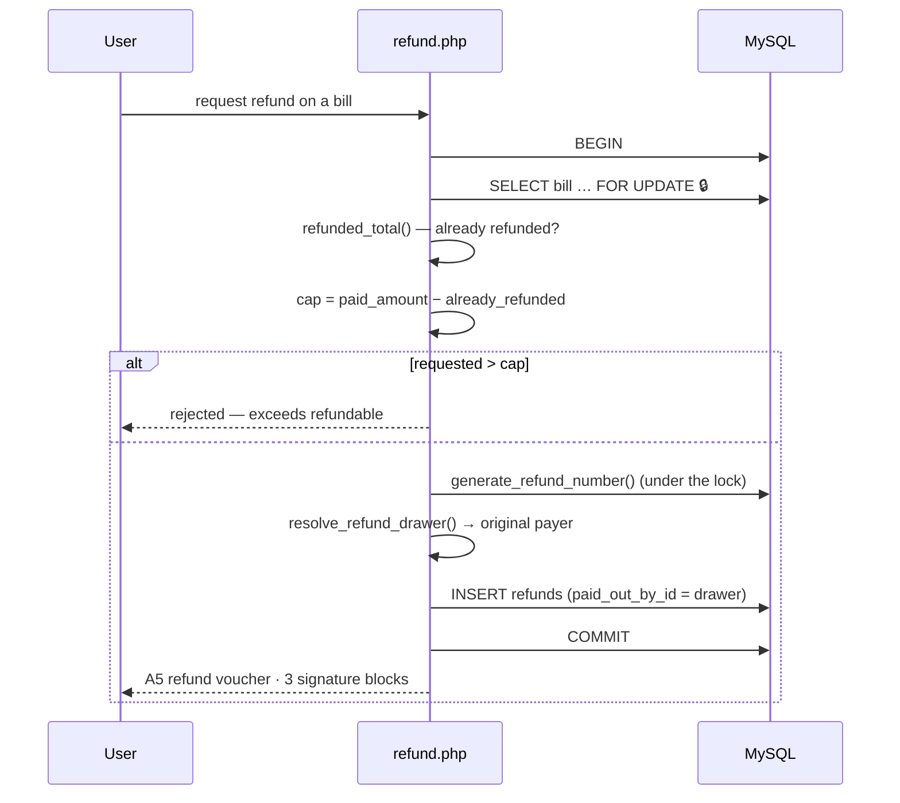
```mermaid
sequenceDiagram
    participant U as User
    participant R as refund.php
    participant DB as MySQL

    U->>R: request refund on a bill
    R->>DB: BEGIN
    R->>DB: SELECT bill … FOR UPDATE  🔒
    R->>R: refunded_total() — already refunded?
    R->>R: cap = paid_amount − already_refunded
    alt requested > cap
        R-->>U: rejected — exceeds refundable
    else
        R->>DB: generate_refund_number()  (under the lock)
        R->>R: resolve_refund_drawer() → original payer
        R->>DB: INSERT refunds (paid_out_by_id = drawer)
        R->>DB: COMMIT
        R-->>U: A5 refund voucher · 3 signature blocks
    end
```

**Mechanics:**

- **Partial refunds** are supported, capped under a **row lock**
  (`SELECT … FOR UPDATE` on the bill).
- `refunded_total()` excludes voided refunds:
  `WHERE bill_id = ? AND voided_at IS NULL`.
- **The cash refund exits the ORIGINAL payer's drawer** — `paid_out_by_id`, resolved by
  `resolve_refund_drawer()`, not whoever clicked the button.
- The printed voucher carries **three signature blocks**.
- `refund_mode` has its **own** three-value vocabulary — deliberately **not** the
  Cash|Online toggle ([§8.7](#87-payment-methods--write-two-read-four)).
- Refund numbering uses the GREATEST-of-(counter, real max) strategy after live
  duplicate-number failures ([§9](#9-document-number-series)).

---

## 24. Flow O — Voids

Admin **soft-void**. Money rows are never deleted.

```php
void_bill()             // consultation
void_admission_bill()   // A-series
void_er_bill()          // E-series
void_procedure_bill()   // P-series
void_refund()           // RF-series
```

Each sets `voided_at`, records the actor and a **mandatory reason**, and audit-logs.

> **The invariant: EVERY money read filters `voided_at IS NULL`.** Every branch of
> `day_cash_tally()`, `refunded_total()`, `clinic_revenue()`, `doctor_earned_for_month()`,
> `doctor_procedure_earnings()` and the P&L carries it. **A new money query without this
> filter is a bug.**

Tables carrying `voided_at`: `bills`, `admission_bills`, `ipd_bills`, `er_bills`,
`procedure_bills`, `dental_procedure_payments`, `ipd_advances`, `refunds`, `expenses`.

**Known gap:** the Google Sheet **reversal on void is pending** — a voided bill still
sits in the exported sheet. See [§36](#36-known-debt--pending-migrations).

---

## 25. Flow P — Expenses & Magic-Link Approval

`expenses.php`, `expense_categories.php`, `approve_expense.php`,
`config/expense_approval.php`.

### Petty cash

- Paid from the **counter drawer**, series **`EXP-`**.
- `expenses.source` — `ENUM('CASH_COUNTER','BANK','OWNER')`. **Only `CASH_COUNTER`
  reduces `expected_cash`** — bank and owner-funded expenses never touched the drawer.
- Expenses key off the **`expense_date` DATE column**, not a timestamp window — they are
  *posted for* a business day.
- Categories (`ADMIN_MANAGE_EXPENSE_CATEGORIES`) carry **per-shift limits**; exceeding
  one triggers the over-limit path (`add_expense_over_limit.sql`).
- Posting requires `FINANCIAL_POST_EXPENSES`.

### The 60-minute magic-link approval

An over-limit expense needs approval from someone who may not be at a desk.

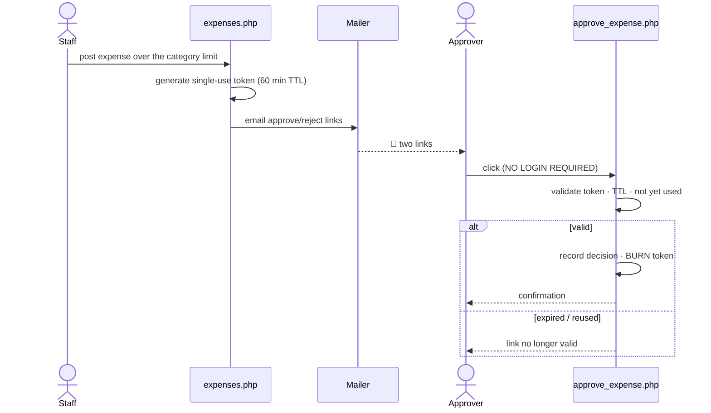
```mermaid
sequenceDiagram
    actor S as Staff
    participant E as expenses.php
    participant M as Mailer
    actor A as Approver
    participant AP as approve_expense.php

    S->>E: post expense over the category limit
    E->>E: generate single-use token (60 min TTL)
    E->>M: email approve/reject links
    M-->>A: 📧 two links

    A->>AP: click (NO LOGIN REQUIRED)
    AP->>AP: validate token · TTL · not yet used
    alt valid
        AP->>AP: record decision · BURN token
        AP-->>A: confirmation
    else expired / reused
        AP-->>A: link no longer valid
    end
```

- **60-minute TTL**, **single-use**, **no login required**.
- **Only the SHA-256 hash is stored** (`token_hash CHAR(64) UNIQUE`); the raw 32-byte
  token travels in the email and nowhere else.
- The token is minted **inside the posting transaction**, so a committed PENDING expense
  always has a matching link.
- The token is **burned by `expense_id`**, not by token — so an in-app decision also kills
  any live emailed link.
- The decision UPDATE carries `AND approval_status = 'PENDING'` under a `FOR UPDATE` lock,
  so a click and a link cannot both decide it.
- An anonymous decider logs `user_id = NULL` with `(via email approval link)` in the
  detail text — `audit_logs.user_id` is nullable for exactly this.
- Status: `ENUM('PENDING','APPROVED','REJECTED')`.

### Over-limit: it flags, it no longer blocks

An over-limit posting was once **hard-blocked** — *"the receptionist could not record cash
that had genuinely gone out (e.g. a Rs 10,000 staff advance issued from a Rs 3,000/day
counter)."* Now it is allowed but flagged `over_limit` with a human-readable `limit_note`,
and forced through the approval flow.

Limits are only checked for **non-admin `CASH_COUNTER`** postings — *"a Rs 400,000 payroll
must not be measured against a Rs 5,000 counter cap."* The category row is locked
`FOR UPDATE` so two simultaneous postings cannot both squeeze under the same remaining
limit.

> **⚠️ A PENDING expense still reduces `expected_cash`** — the cash left the drawer the
> moment it was posted. **So does a REJECTED one**: the tally's expense query filters only
> `voided_at IS NULL`, while `clinic_operating_expenses()` additionally excludes
> `approval_status = 'REJECTED'`. **This is the one place the shift tally and the P&L
> deliberately diverge.**

`clinic_operating_expenses()` also **skips `is_disbursement` categories entirely**, so a
Doctor Shares payout is never double-counted against profit.

> **⚠️ Migration status: the expense-approval migration is PENDING.**

---

## 26. Flow Q — Bookings & Scheduling

**Bookings** (`bookings.php`, live 2026-07-23) — status
`ENUM('BOOKED','ARRIVED','CANCELLED','NO_SHOW')`. Marking a booking **ARRIVED** feeds the
patient into the registration flow.

**Doctor timings** (`doctor_timings.php`) — a shift-start popup plus a per-day sheet,
**two sessions per doctor**. Availability: `ENUM('AVAILABLE','DELAYED','OFF')`.

**Weekly schedule** (`my_schedule.php`) — a doctor's own weekly template, which
**prefills reception's day sheet** so the desk isn't retyping a fixed roster.

> **⚠️ The 22:00 no-show cron (`cron/mark_no_show.php`) is NOT registered in hPanel.**
> Bookings are not being auto-marked `NO_SHOW`.

---

## 27. Reports & Analytics

| Report | File | Access |
|---|---|---|
| Dashboard | `dashboard.php` | all (scoped) |
| Income | `income_report.php` | `FINANCIAL_VIEW_CLINIC_REPORTS` |
| **P&L** | `pnl_report.php` | **ADMIN ONLY** |
| **Doctor Share Statement** | `doctor_share_statement.php` | **ADMIN ONLY** |
| **Tax Register** | `tax_register.php` | **ADMIN ONLY** |
| Doctor payouts | `doctor_payouts.php` | `FINANCIAL_RUN_PAYOUT` |
| Doctor analytics | `doctor_analytics.php` | doctor (own) |
| Doctor earned | `doctor_earned.php` | `FINANCIAL_VIEW_OWN_EARNINGS` |
| Expense report | `expense_report.php` | `FINANCIAL_VIEW_CLINIC_REPORTS` |
| Discount report | `discount_report.php` | `FINANCIAL_VIEW_CLINIC_REPORTS` |
| IPD stay report | `ipd_stay_report.php` | `IPD_VIEW_WARD` |
| Sheet log | `sheet_log.php` | admin |

### Aggregation functions

| Function | Returns |
|---|---|
| `clinic_revenue($start, $end)` | Gross revenue, all streams |
| `clinic_doctor_shares($start, $end)` | Doctor shares — a **revenue deduction** |
| `clinic_income_buckets($start, $end, $bucket)` | Time-bucketed income (`day`/`month`/`year`) |
| `clinic_operating_expenses($start, $end)` | Operating expenses |
| `doctor_earned_for_month($doctorId, $month)` | One doctor's earned share |
| `doctor_procedure_earnings($doctorId, $from, $toExcl)` | Procedure earnings, per-line |
| `month_closing($month)` / `require_month_open()` | Monthly lock |

> **⚠️ Accounting rule: the doctor's share is a REVENUE DEDUCTION, not an expense.** It
> is subtracted before arriving at clinic revenue — it never appears in
> `clinic_operating_expenses()`. Treating it as an expense would overstate both revenue
> and costs.

**Tax-first split applies everywhere.** The **P&L is admin-only.**

`partials/period_chart.php` provides a shared **Day / Month / Year / Total** bar chart
used on both the doctor and admin report surfaces.

**Doctor money visibility:** the doctor UI **hides billing** (`$hideMoney`), and a
doctor's revenue figure is their **EARNED share**, never the gross the patient paid.

---

## 28. Notifications & Email

`config/notifications.php` (in-app writes), `config/notify.php` (~49 KB event
catalogue), `partials/notification_bell.php`, `notification_settings.php`.

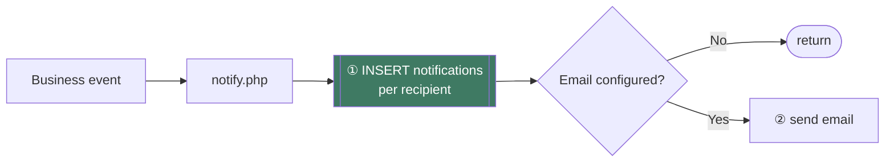
```mermaid
flowchart LR
    EV[Business event] --> N["notify.php"]
    N --> INAPP[["① INSERT notifications<br/>per recipient"]]
    INAPP --> CHK{Email configured?}
    CHK -->|No| STOP([return])
    CHK -->|Yes| MAIL[② send email]

    style INAPP fill:#3F7A63,color:#fff
```

> **⚠️ Ordering invariant: the in-app write MUST precede `notify.php`'s
> `if (!$email) return;` guard.** If the in-app insert sat after that early return, every
> recipient without a configured email address would silently receive **no notification
> at all** — not even the bell badge.

- **Per-recipient fan-out:** one row per recipient, so read state is individual. IDs are
  deduped and zero-filtered inside `notify_users()`, so callers can pass a raw list.
- **The bell always fires; email is the only configurable part.** `notify_invoice_raised`
  shows this most sharply — the bell reaches a doctor with **no email on file at all**.
- `config/mailer.php` is a **hand-rolled SMTP client** — no Composer, no PHPMailer —
  speaking Hostinger's dialect (implicit SSL on 465, `AUTH LOGIN`), base64 body to
  sidestep dot-stuffing entirely. Sends are always best-effort and always **after
  commit**.
- `email_log` records every send with status `sent|failed|skipped`.

### The event catalogue

**13 bell types** and **14 email switch keys**:

| Bell type | Email key | Recipients |
|---|---|---|
| `invoice_raised` | `invoice_raised` | the visit's doctor |
| `refund_issued` | `refund_issued` | admin + approving doctor |
| `patient_admitted` | `patient_admitted` | admin + admitting doctor |
| `patient_admitted` *(IPD reuses it)* | `ipd_patient_admitted` | admin + consultant |
| `patient_discharged` | `patient_discharged` | admin |
| `booking_created` / `booking_cancelled` | same | the booked doctor |
| `expense_approval` / `expense_approval_over_limit` | `expense_approval` | admin + approvers |
| `expense_approved` / `expense_rejected` | `expense_decided` | poster + admin |
| `day_closed` | `day_closed` | admin + handover recipient |
| `closing_edited` | `closing_edited` | admin + handover recipient |
| `procedure_discount` | `procedure_discount` | the performing doctor |
| — *(email only)* | `staff_welcome` | the new user |
| — *(email only)* | `daily_summary` | admin alert address |

**Settings default to OFF for everything except `staff_welcome`.** `notif_email_enabled()`
is **global and overriding** — a doctor who ticked `email_on_new_patient` still gets
nothing if `invoice_raised` is off. A per-user flag can only *narrow* an enabled event,
never widen a disabled one.

> **⚠️ It defaults to TRUE on a missing row or missing table**, so an unmigrated server
> keeps mailing rather than going silently mute — but it also means **a brand-new event
> type with no seeded row mails until someone switches it off.**

**Two deliberate exceptions:** `notify_staff_welcome` is **ungated and writes no bell** —
it carries the temporary password, and a bell notification is useless to someone who
cannot yet sign in (the settings screen renders it checked-and-disabled and force-enables
it on every save). `daily_summary` is email-only.

> **⚠️ Catalogue mismatch:** IPD admission gates its *email* on `ipd_patient_admitted` but
> writes its *bell* row as type `patient_admitted` — so any future per-type mute would
> treat IPD and ER admissions as one class.

Switching `expense_approval` off *"does more than silence a message — the 60-minute
one-click magic link is the only approval path that works without signing in."*

> **⚠️ The `notifications` table migration is PENDING.**

---

## 29. Google Sheets Integration

`config/sheets.php`, `sheet_log.php`, `cron/sheet_retry.php`.

A **yearly-tab** log — each year gets its own tab — reproducing the pre-HIMS spreadsheet
layout. Every push runs **after `commit()`** and can never throw into the page: *"An
unreachable sheet must never cost the clinic a saved payment."*

### The 45-column contract

`sheet_columns()` **IS** the sheet's header row, written positionally.

> **Never reorder it — only append.** Changing the order silently misaligns every future
> row against the historical sheets.

Two headers are **deliberately malformed and must stay that way**: the old sheet
distinguishes two COUNT columns from the amount columns of the same name **only by a
stray backtick and a trailing space**. The Apps Script matches on the sheet's own header,
so "tidying" either string would make HIMS append a **duplicate column** instead of
filling the existing one. (The typo `user-emal` is preserved for the same reason.)

Any service not in the alias map lands in **`Other Procedures`** rather than being
dropped, so admin can add services freely and the money always shows up somewhere.

### Idempotency

`sheet_sync_log` has `UNIQUE (doc_type, doc_ref)`, and a row already `sent` short-circuits
the push. This matters because a bill is pushed at registration **and** again if someone
later settles it — and **the sheet APPENDS**, so sending twice would put two rows in the
ledger. *"The sheet is an append-only log of what happened, not a mirror that tracks later
edits."*

The attempt is **logged before it is made**, so a request that dies mid-push is already on
file as outstanding for the retry cron. Retries re-send the **stored payload** verbatim
(so figures match the moment they were captured) but always swap in the **current**
shared secret, in case it was rotated.

### ⚠️ Two real wiring gaps

`sheet_sync_log.doc_type` is `ENUM('INVOICE','ADMISSION','DISCHARGE')` — but the dispatcher
handles **four** values and call sites use **five**:

| Doc type | In ENUM? | Row builder? | Actual behaviour |
|---|---|---|---|
| `INVOICE` | ✅ | ✅ | works |
| `ADMISSION` | ✅ | ✅ | works |
| `DISCHARGE` | ✅ | ✅ | works |
| **`ER_SERVICE`** | ❌ | ✅ | **reaches the sheet, but cannot be logged** |
| **`PROCEDURE`** | ❌ | ❌ | **silently never reaches the sheet at all** |

1. **`ER_SERVICE`** — the row builder exists and the row *does* reach the sheet, but the
   log INSERT fails on the ENUM and is swallowed by the catch. **So a failed ER push is
   invisible on the sync log and is never retried** — the self-healing guarantee does not
   cover it.
2. **`PROCEDURE`** — `procedure_bill.php` calls `sheet_push($pdo, 'PROCEDURE', …)`, but
   there is **no dispatch branch and no row builder**, so `$row` stays null and the
   function returns immediately. **Procedure bills never reach the Google Sheet**, with no
   log row, no error and no retry.

Both need `ALTER TABLE sheet_sync_log MODIFY doc_type ENUM(…,'ER_SERVICE','PROCEDURE')`,
plus a row builder for procedures. **Neither migration exists.**

> **⚠️ Void reversal is also pending** — voiding a bill does not retract its sheet row.

**Cron paths must be `public_html/hims/cron/`** — verified against File Manager: `hims`
sits **directly** under `public_html`, with no `domains/babymedics.com/` segment despite
being served from the subdomain.

---

## 30. Cron Jobs

| Script | Schedule | Registration |
|---|---|---|
| `cron/daily_summary.php` | daily **21:00** PKT | ✅ **registered and verified running** |
| `cron/mark_no_show.php` | daily **22:00** PKT | ⚠️ unverified |
| `cron/sheet_retry.php` | hourly | ⚠️ unverified |

All three share the same auth shape: **CLI runs freely; browser runs need `?key=`**
(default `hims-daily-2026`, overridable in `config/mail.php`).

**`daily_summary.php` does two jobs**, and the ordering matters:

1. **The procedure-discount auto-close sweep runs FIRST and unconditionally** — even when
   the summary email itself is switched off. The email gate is checked at the *send*, not
   at the top of the file, because the sweep is real bookkeeping.
2. The digest itself — sent **even on a quiet day, so silence is distinguishable from a
   broken cron.**

> **Why the sweep lives here rather than in its own file:** *"Several HIMS crons have been
> written and never registered in hPanel; this one is at least safe when that happens."*
> This is the explicit statement of registration status for the whole set — and the
> reason **`daily_summary.php` is the one cron you can rely on.**

**Every cron is self-healing.** `mark_no_show` sweeps every `booking_date <= today`, not
just today's; `sheet_retry` picks up anything still `failed` under 12 attempts. A missed
night catches up on the next run rather than stranding rows permanently. System sweeps
audit-log with `user_id = NULL`.

> Registration lives in the Hostinger hPanel, **not** in the repository — a script
> existing in `cron/` is **not** evidence that it runs. Verify in hPanel.

---

## 31. UI Shell & Design System

### `partials/head.php`

Replaces the per-page boilerplate and the **13 divergent inlined `:root` blocks** that
preceded it. **This partial opens the document through `<body>`**; the page supplies its
own `</body></html>`.

**① The pre-paint view bootstrap** — inline, synchronous, and placed **before** the
stylesheet link, so `<html data-view>` is stamped before any CSS is parsed:

```javascript
var v = 'auto';
try { v = localStorage.getItem('hims-view') || 'auto'; } catch (e) {}
if (v !== 'mobile' && v !== 'desktop') v = 'auto';
document.documentElement.setAttribute('data-view', v);
if (v === 'desktop') {   // ALSO rewrite the viewport meta, here — not in the toggle's JS
    m.setAttribute('content', 'width=1280, initial-scale=' + (sw / 1280).toFixed(3));
}
```

Forced-desktop rewrites the **viewport meta here** so a phone renders at a fixed desktop
width from the very first paint — "request desktop site" with no reflow flash.
`localStorage` is wrapped because **private-mode Safari throws on access**.

**② Cache-busted CSS** — `assets/app.css?v=<filemtime>`:

> The server sends `Cache-Control: max-age=604800`. Without the buster a browser keeps a
> **seven-day-old `app.css`** after a deploy — which on 2026-07-26 meant the new theme
> shipped, the deploy went green, and staff saw the page render with **no sidebar styling
> at all**: unstyled markup and giant un-sized SVG icons.

**③ The global double-submit lock.** The failure it prevents: *a user clicks Admit/Save/
Refund, the server lags with no feedback, they click again — and the second click fires a
**second real action** before the first returns.* Two capture-phase triggers (`submit` on
forms, `click` on `[data-once]`), first activation wins.

> One subtlety: `disabled = true` is deferred by `setTimeout(…, 0)` **so a submit button's
> value still posts with the form** — a disabled control is omitted from the payload.

Navigation links, the sidebar and tabs are deliberately **not** guarded: a GET link that
merely opens a page is safe to re-click.

**④ Auto-dismissing success flashes** (2 s), targeting every success-alert dialect in use.
**Error alerts and CTA-bearing messages are deliberately left alone.**

### `partials/sidebar.php` — and the global app bar

> **The app bar is emitted by `sidebar.php` on EVERY page, for EVERY role — including
> doctors.** Never re-add a per-page header. **There is no messages icon.**

It used to be opt-in: 15 pages required it by hand and the other 27 had no top bar at all.

> *"Search, alerts and logout came and went as you moved around the product… the bar was
> **the one piece of the UI that had to be constant and was the least constant thing in
> the product.**"*

Including it from the sidebar makes it **structural: a page cannot lose the bar without
also losing its navigation.** A render-once guard (`$GLOBALS['__qh_rendered']`) turns the
~15 legacy hand-includes into no-ops rather than drawing a second bar.

**Contents, left to right (48 px):** search → spacer → date → notification bell → avatar
→ logout.

**What was removed and why:** six tinted destination buttons and a gradient hero. Every
one of those destinations already existed in the sidebar, *"so the row was a second
navigation competing with the first — five hues fighting each other and the brand."*
Removing it returned **~180 px of vertical space above the queue** on the busiest screen
in the product. Per-destination badge counts went with them: today's queue length belongs
on the page it describes, *"not in shared chrome that every page pays a `COUNT(*)` for
whether it shows it or not."*

**Layout contract:**

```php
require 'partials/head.php';      // opens <body>
$navActive = 'patients';
require 'partials/sidebar.php';   // renders .app > aside + opens .main
    // ... page content ...
</div></div>                      // close .main + .app
</body></html>
```

Desktop ≥900 px: fixed 264 px left column. Below that: an off-canvas drawer — **before
this partial there was no mobile navigation at all.** The drawer's auto-close binding is
scoped to exclude `.nav-parent`, because that button *expands a submenu, it doesn't
navigate* — closing the drawer on it would make Settings impossible to open on mobile.

### Design system — Sage & Clay

The **sage/clay** palette replaced the previous teal. Legacy `--teal` / `--teal-2` token
*names* are retained as aliases (only the values moved), so old rules keep working:

```css
:root { --teal:#223A31; --teal-2:#3F7A63; --ink:#16211C; --muted:#616D65;
        --bg:#E7ECE4; --card:#F8FAF6; --border:#D6DDD0; }
```

### Conventions

| Convention | Rule |
|---|---|
| **Dates** | **dd/mm/yyyy** on display; `assets/js/date-picker.js` keeps a hidden `yyyy-mm-dd` for the server. **Any new page with a date input MUST load `date-picker.js`.** |
| **Names** | ALL-CAPS: stored uppercase, `input.uc` uppercases as typed, uppercased again on every A5 print. |
| **View toggle** | `data-view` on `<html>`, set pre-paint; **A57-first** mobile baseline. |
| **Timezone** | PKT everywhere ([§2](#2-architecture--request-lifecycle)). |

---

## 32. Printing & Paper Sizes

All patient-facing documents are designed **A5-first**.

| Document | Partial |
|---|---|
| Consultation slip | `views/invoice_print_partial.php` |
| Procedure invoice | `views/procedure_invoice_print_partial.php` |
| Procedure consent | `views/procedure_consent_print_partial.php` |
| ER invoice | `views/er_invoice_print_partial.php` |
| Refund voucher | `views/refund_print_partial.php` |
| Day-closing slip | `views/closing_print_partial.php` |
| Doctor share statement | `views/doctor_share_print_partial.php` |
| Dental receipt | `views/dental_account_receipt_partial.php` |
| Dental statement | `views/dental_account_statement_partial.php` |
| Dental consent | `views/dental_consent_print_partial.php` |

### ⚠️ Two DIFFERENT paper-size mechanisms — do not conflate them

| | **`users.invoice_paper_size`** | **`partials/paper_size.php`** |
|---|---|---|
| Applies to | the **consultation slip** | **IPD documents** |
| Chosen by | the **doctor**, once, on Staff & Doctors | whoever is **printing**, at print time |
| Stored in | the DB, per doctor | `localStorage['hims.paperSize']`, **per browser** |
| Reception's role | **never picks a size** — the slip prints in the visiting doctor's saved size automatically | picks per print |

The print-time picker exists because *"the same sheet is sometimes wanted on A5 for the
patient's file and A4 for the ward folder."* Because **`@page` size cannot be changed by a
CSS class**, it rewrites the rule into a live `<style>` element and mirrors the choice onto
`data-paper` — content width has to follow the paper, or an A5-width layout prints as a
narrow column down the middle of an A4 sheet.

A4 is not merely a bigger sheet: it keeps the same layout but **enlarges every metric
~1.35×**, so it reads as a full-page document rather than a small receipt marooned on a
big page.

**The consultation slip** is a one-line A5 slip with **flex-aligned headers — no magic
pixel offsets.** Everything below the vitals row is left blank **on purpose**: it is the
doctor's handwriting area.

### Reprint fidelity

`print_stamp()` / `print_stamp_by()` freeze **both the timestamp and the cashier at the
first print**, so a duplicate is a true facsimile. They were once `date()` and
`$_SESSION['user_id']` — *"which meant every reprint contradicted the copy already in the
patient's hand."*

> **⚠️ Opening the admission invoice print view LOCKS the bill** (it stamps `printed_at`,
> and `$locked` gates every edit). That is why the print link is hidden on an unpaid bill
> — exposing it early would freeze an editable bill. The day-closing slip is the
> exception: it re-stamps on every print, because a revised closing must show its new
> print time.

### Branding — `config/brand.php`

Two identities, chosen by the **treating doctor's specialty**: **BABY MEDICS** normally,
**SMILE RESORT** when `specialty === 'DENTAL'`. A NULL specialty (ER bill, closing slip,
share statement — anything with no single treating doctor) takes the house brand.

> **The bug it fixed:** `brand()` once returned SMILE RESORT *unconditionally*, so a
> paediatric visit printed the dental name over the baby-face logo — **the wordmark and
> the mark disagreed on the same sheet.** The real fix was that the **name** had to vary
> too, not just the logo.

It exists because the same five variables were copy-pasted into **seven print views**,
with the address additionally hardcoded as raw `<div>`s in four of them — *"a rename meant
editing eleven places and hoping none was missed."*

Like `payment_methods.php`, it must stay require-able from anywhere with **no session or
DB dependency**, because print partials load it before any bootstrap exists.

**Deliberately not covered:** app chrome (staff-facing UI stays "HIMS" — *that is the
software's name, not the clinic's*), email (a DNS + mailbox move), and the Sheets tab
pattern (keyed to existing invoice history).

---

## 33. Database Schema Reference

Reconstructed from ~110 migrations in `sql/` and `sql/ipd/`.

### Domain map

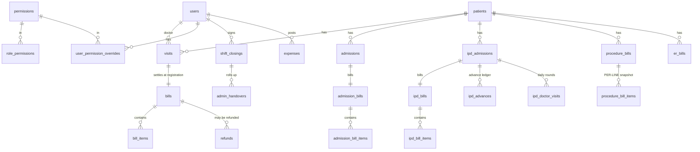
```mermaid
erDiagram
    users ||--o{ visits : "doctor"
    users ||--o{ user_permission_overrides : has
    permissions ||--o{ role_permissions : in
    permissions ||--o{ user_permission_overrides : in

    patients ||--o{ visits : has
    visits ||--|| bills : "settles at registration"
    bills ||--o{ bill_items : contains
    bills ||--o{ refunds : "may be refunded"

    patients ||--o{ admissions : has
    admissions ||--|| admission_bills : bills
    admission_bills ||--o{ admission_bill_items : contains

    patients ||--o{ ipd_admissions : has
    ipd_admissions ||--|| ipd_bills : bills
    ipd_bills ||--o{ ipd_bill_items : contains
    ipd_admissions ||--o{ ipd_advances : "advance ledger"
    ipd_admissions ||--o{ ipd_doctor_visits : "daily rounds"

    patients ||--o{ procedure_bills : has
    procedure_bills ||--o{ procedure_bill_items : "PER-LINE snapshot"

    patients ||--o{ er_bills : has
    users ||--o{ shift_closings : signs
    shift_closings ||--o{ admin_handovers : "rolls up"
    users ||--o{ expenses : posts
```

### Core tables

**Identity & RBAC**

| Table | Purpose |
|---|---|
| `users` | Staff & doctors. `base_role ENUM('ADMIN','DOCTOR','STAFF')`, `is_active`, `phone` (local), `specialty`, `consult_share_pct`, `consult_has_tax`, `consult_tax_pct`, `invoice_paper_size` |
| `permissions` | Catalogue — `key`, `label`, `category` |
| `role_permissions` | Role defaults (`base_role` → `permission_id`) |
| `user_permission_overrides` | Per-user `granted` = 1 (grant) / 0 (revoke) |
| `audit_logs` | `user_id`, `action`, `details` |
| `staff_documents` | Private uploads; `doc_type ENUM('CNIC','EDUCATIONAL_DEGREE','REGISTRATION','EXPERIENCE_LETTER','CV','OTHER')` |

**Patients & OPD**

| Table | Notable columns |
|---|---|
| `patients` | `mrn`, name (uppercase), `gender ENUM('MALE','FEMALE','OTHER')`, phone (E.164), `discount_category_id` |
| `visits` | `patient_id`, `doctor_id`, `consult_type_id`, `consult_status ENUM('WAITING','IN_CONSULT','DONE')`, `started_at`, `disposition` |
| `bills` | `invoice_number`, `visit_id`, `status ENUM('draft','finalized','paid','waived')`, `payment_method`, `paid_amount`, `paid_at`, **`paid_by_id`**, `created_by_id`, **`voided_at`** |
| `bill_items` | `bill_id`, `description`, `quantity`, `unit_rate`, `amount` |
| `consultation_notes` | Private doctor notes |
| `consult_types`, `doctor_consult_types` | Consultation catalogue & per-doctor fees |
| `discount_categories` | Standing patient discounts |

**Admissions / IPD**

| Table | Notes |
|---|---|
| `admissions` | `status ENUM('ACTIVE','DISCHARGE_IN_PROGRESS','DISCHARGED')` |
| `admission_bills` | "A" series, `status IN ('paid','finalized')`, `voided_at` |
| `admission_bill_items` | `charge_type ENUM('FLAT','HOURLY','PER_UNIT')` |
| `admission_vitals` | Temperature in **Fahrenheit** |
| `admission_care_events` | `ENUM('DOCTOR_VISIT','NURSING_CARE','MEDICATION','OBSERVATION','HANDOVER','SERVICE','OTHER')` |
| `ipd_admissions` | `status ENUM('PENDING_ASSIGNMENT','ACTIVE','DISCHARGE_IN_PROGRESS','DISCHARGED')`, `assigned_nurse_id` |
| `ipd_bills` | "I" series, **`advance_applied`**, `voided_at` |
| `ipd_bill_items` | `item_type ENUM('STAY','NURSING','MO','CONSULT_VISIT','SERVICE')` |
| `ipd_doctor_visits` | **`visit_charge` FROZEN snapshot**, `is_paid` |
| `ipd_advances` | `direction ENUM('PAYMENT','REFUND')`, `paid_by_id`, `paid_at`, `voided_at` |
| `ipd_room_rates` | `rate_mode ENUM('HOURLY','DAILY')`, per-day nursing & MO |
| `ipd_vitals`, `ipd_nurse_services`, `ipd_care_service_events` | Clinical records |

**Procedures / Dental / ER**

| Table | Notes |
|---|---|
| `procedure_master` | Catalogue: price, share %, tax, disposables |
| `procedure_bills` | "P" series, `voided_at` |
| `procedure_bill_items` | **Per-line** `doctor_share_pct`, `has_tax`, `tax_percent`, `disposables` |
| `procedure_consents` | `status ENUM('PENDING','SIGNED')`, frozen template, signer CNIC |
| `er_bills` | "E" series, mandatory doctor, `voided_at` |
| `dental_*` | Chart, treatment, accounts `ENUM('OPEN','SETTLED','CANCELLED')`, lab `ENUM('PENDING_RECEIPT','EDITED','RECEIVED')` |
| `dental_procedure_payments` | **`amount`** (no `paid_amount`), `'paid'|'voided'`, `voided_at` |

**Money control**

| Table | Notes |
|---|---|
| `shift_closings` | Per-user snapshot, `DC-` number, day lock |
| `admin_handovers` | Roll-up + drill-down |
| `monthly_closings` | Month lock |
| `refunds` | `RF-YYYY-NNNN`, `refund_mode`, **`paid_out_by_id`**, `voided_at` |
| `refund_sequences` | `sequence_year`, `last_sequence` |
| `expenses` | `EXP-`, `source ENUM('CASH_COUNTER','BANK','OWNER')`, `expense_date`, `posted_by_id`, `voided_at` |
| `expense_categories` | Shift limits |
| `clinic_settings` | Key/value: `opening_float`, `day_cutoff_hour` |
| `invoice_counters`, `admission_invoice_counters`, `er_invoice_counters`, `procedure_invoice_counters` | `(yr, mo, next_seq)` |

**Platform**

`notifications`, `email_log`, `sheet_sync_queue`, `bookings`
(`ENUM('BOOKED','ARRIVED','CANCELLED','NO_SHOW')`), `doctor_day_timings`
(`ENUM('AVAILABLE','DELAYED','OFF')`), `doctor_weekly_schedule`, `locations`.

### Diagnostic scripts (not DDL)

`check_migrations_applied.sql` (the sentinel audit), `check_consent_migrations.sql`,
`check_procedure_discount_ready.sql`, `check_report_permissions.sql`,
`verify_procedure_discount.sql`, `verify_consultation_notes.sql`,
`verify_accounts_state.sql`, `sql/ipd/verify_ipd_nurse_services.sql`, and the `diag_*`
family.

> **⚠️ Verification rule: a migration is "applied" only when
> `information_schema` says so.** Claims that a migration ran have been wrong repeatedly.
> Query the database — it is the only authority.

> **⚠️ No stored procedures.** The DB user is denied `CREATE ROUTINE` (error #1044).
> Write **flat ALTERs** and **fully qualify every table**.

---

## 34. Conventions & Invariants

### Money

1. **Cash basis** — recognise on `paid_at`, never on creation.
2. **`voided_at IS NULL` on every money read.** No exceptions.
3. **Snapshot rates onto the row.** Never join to a live rate for a historical figure.
4. **Fold once, un-fold for display.** Any stream given its own row must be un-folded
   from the admission bucket.
5. **Net ledger money out of bill totals** — IPD `paid_amount − advance_applied`.
6. **Doctor share is a revenue deduction**, not an operating expense.
7. **Patient invoices carry no tax.** Tax is withheld from the doctor's share.
8. **Clinic = remainder − doctor** (subtraction, so parts re-sum exactly).
9. **Refunds stay out of revenue buckets** so drill-downs tie to totals.
10. **`require_day_open()` before any money write.**

### Code

11. **`require_permission()` + matching sidebar `perm`** — both, always.
12. **Never gate on a role.** `guard_admin.php` is the single deliberate exception.
13. **Guard schema-dependent reads** so an unrun migration degrades to zero, not a 500.
14. **`column_exists()` before touching a maybe-migrated column.**
15. **Keep `doctor_split()` and `doctor_split_sql()` in lockstep.**
16. **Never pass user input to `doctor_split_sql()`** — the arguments are interpolated
    SQL.
17. **Audit through `audit_log()`** so impersonation is tagged.

### Money, continued

17b. **Snapshot everything at the moment of sale** — line share/tax/disposables, account
   `discount_pct`, consent text, item descriptions, print stamps. Catalogue edits are
   never retroactive.
17c. **A flat Rs discount, never a stored %** on procedures — a % silently re-scales when
   lines are edited.
17d. **`0.009` is the universal money epsilon**; `0.01` is the tie-out epsilon.
17e. **Emails, sheet pushes and advance returns fire AFTER commit**, always wrapped.

### Platform

18. **No stored procedures** — flat ALTERs, fully-qualified tables. A migration that wraps
    ALTERs in `CREATE PROCEDURE` **silently does nothing** on this host (#1044) while
    still appearing to run.
18b. **No `ENGINE`/`CHARSET` clause** on tables FK'd to `users`/`patients` — forcing
    `utf8mb4` mismatches them and every FK dies with errno 150, silently aborting the
    `CREATE` while the `INSERT`s succeed.
18c. **Probe before touching a maybe-migrated column**, and document the fallback
    *direction* — code auto-deploys on push while migrations are run by hand, so there is
    always a window where the column is absent.
19. **Never edit PHP with PowerShell `Set-Content`** — it writes a BOM that fatals PHP
    includes. Use the Edit tool or `sed -i`, and verify with `od`.
20. **Verify migrations via `information_schema`**, never by assumption.
21. **After extracting a shared helper, resolve each caller's full require chain** — a
    grep is not proof; that mistake shipped two pages that fataled.
22. **A duplicated label map hides raw-enum leaks** — grep for surfaces with *no* map.
23. **The word "ward" appears in no UI string.**
24. **New date-input pages must load `date-picker.js`.**
25. **Verify deploys without a cache-buster** — statics cache 7 days; PHP files verify
    via the public `.ftp-deploy-sync-state.json` sha256s.

---

## 35. Deployment

**GitHub → Actions → FTP → Hostinger.** Push to `main` auto-deploys.

```mermaid
flowchart LR
    A[git push main] --> B[GitHub Actions]
    B --> C{FTP sync}
    C -->|Success| D[Live in ~1–2 min]
    C -->|ETIMEDOUT| E[⚠️ Transient — RETRY]
    E --> F["⚠️ Failed run POISONS sync state<br/>next run goes green<br/>uploading NOTHING"]

    style F fill:#B91C1C,color:#fff
```

### Verification checklist

1. **Confirm the commit's Actions run is green** — deploys lag 1–2 minutes and runs fail.
2. **A green ~18-second run may have uploaded nothing.** Check the file list.
3. **A failed run poisons the sync state** — subsequent runs report success while
   transferring nothing. Recover before trusting green.
4. **Verify PHP files via the public `.ftp-deploy-sync-state.json` sha256s.**
5. **Statics cache 7 days** — new assets must be `filemtime`-versioned. Run **both** a
   cache-busted and a plain `curl`: a stale plain fetch is the **CDN**, not a failed
   upload.
6. **Compare against `git show HEAD:<file>`, never the CRLF working copy.**
7. **FTP `ETIMEDOUT` is a transient outage** — one cleared itself after ~5 hours. A local
   port scan is **not** proof FTP is down; retry.

> **⚠️ Never push schema-dependent code before its migration is applied and verified.**

Not deployed: `config/db.php`, `config/mail.php`, `config/sheets.php` (gitignored
secrets), and `uploads/`.

> **⚠️ A gitignored directory can never receive a committed guard file.**
> `config/staff_documents.php` therefore writes the `uploads/.htaccess` deny rule **at
> runtime**.

---

## 36. Known Debt & Pending Migrations

### Pending migrations

| Migration | Blocks |
|---|---|
| `add_notifications.sql` | In-app notifications |
| `add_expense_approvals.sql` | Magic-link expense approval |
| `add_invoice_paper_size.sql` | Per-doctor A5/A4 default |
| `add_admission_manual_discount.sql` | Admission lump-sum discount |
| `add_manager_role.sql` | MANAGER preset + `managerial` category |
| `sql/ipd/add_ipd_advances.sql` | **Required to enable IPD advances** |
| `lock_finance_reports_to_admin.sql` | Admin-only finance reports |

> Verify each against `information_schema` before trusting this table —
> `sql/check_migrations_applied.sql` is the sentinel audit. Last full audit: 2026-07-27.

### 🔴 Security items — ordered by severity

| # | Issue | Detail |
|---|---|---|
| **1** | **`login_fix.php` is live** | Unauthenticated. Gated by a hardcoded `FIX-HIMS-2026` in a tracked file. Resets **any admin's password** and enumerates every admin's id/name/email/phone. Self-deletes only *after* a successful reset. **Delete this file.** |
| **2** | **No app-wide CSRF** | Only `impersonate.php` is protected. Every other POST — payments, refunds, voids, closings — is forgeable. |
| **3** | **No `session_regenerate_id()`** | Nowhere in the app. Session fixation is undefended. `logout.php` calls `session_destroy()` only — no `$_SESSION = []`, no cookie expiry. |
| **4** | **No login throttle or lockout** | Unlimited password guessing; failures write **no audit row**. |
| **5** | **Deactivation message confirms a valid password** | The `is_active` check runs *after* `password_verify()` succeeds. |
| **6** | **`must_change_password` never enforced** | Set at login, cleared on change — but **no page redirects on it**. |
| **7** | **No `password_needs_rehash()`** | Bcrypt cost never upgrades. |

### Functional gaps

| Issue | Impact |
|---|---|
| **Sheets: `PROCEDURE` silently inert** | No dispatch branch, no row builder — procedure bills **never reach the sheet**, with no log row and no error |
| **Sheets: `ER_SERVICE` unloggable** | Row reaches the sheet, but the ENUM rejects the log row — **failures are invisible and never retried** |
| **Sheets: void reversal pending** | Voided bills remain in the exported sheet |
| **No-show / sheet-retry crons unverified** | Only `daily_summary.php` is confirmed registered |
| **Dental code not pushed** | Migrations applied & verified 2026-07-28; **code not yet deployed** |
| **IPD zero-rate bills** | Historical bills charged Rs 0; **cannot be retro-fixed** — the assembler reads frozen `visit_charge` snapshots, not the rate table |
| **`admission_services` hourly silent-zero** | An HOURLY service with no duration bills Rs 0; IPD guards this, the admission handler does not |
| **Doc/DDL disagreements** | `add_dental_module.sql` says lab routes through `disposables` (**it must not**); its prose says account status `COMPLETED` (**DDL says `SETTLED`**) |

### Historical incidents worth remembering

| Incident | Lesson |
|---|---|
| Duplicate `RF-2026-0001` issued | `LAST_INSERT_ID()` on `ON DUPLICATE KEY` update is unreliable → GREATEST-of-(counter, real max) |
| Procedure cash missing from `expected_cash` | A new revenue stream must be added to `day_cash_tally()` the same day it goes live |
| `ipd_invoice.php` printed "Paid (bank_transfer)" | A duplicated label map hides raw-enum leaks → one shared `pay_method_label()` |
| Impersonation exit restored a demoted admin's rights | Hold the exit path to the entry path's standard |
| Date-picker month arrows dead | `renderPopup` reset the view on every redraw; trace events before writing de-dup logic |
| Stranded negative-cash shift could never close | Edge cases in closing must be closable |
| Two pages fataled after a helper extraction | Resolve the include graph, don't trust a grep |

---

## Appendix A — Quick Function Index (`config/billing.php`)

| Function | Line | Purpose |
|---|---|---|
| `generate_invoice_number()` | 16 | Consultation `{seq}{YY}{MM}` |
| `recalc_bill_totals()` | 36 | Sum items → totals (zero tax) |
| `generate_refund_number()` | 52 | `RF-YYYY-NNNN` |
| `refunded_total()` | 88 | Non-voided refunds on a bill |
| `create_bill_for_visit()` | 106 | **Settled** consultation bill |
| `generate_admission_invoice_number()` | 164 | `A{seq}{YY}{MM}` |
| `generate_er_invoice_number()` | 203 | `E{seq}{YY}{MM}` |
| `generate_procedure_invoice_number()` | 235 | `P{seq}{YY}{MM}` |
| `doctor_procedure_earnings()` | 276 | Per-line procedure earnings |
| `procedure_disposables_column()` | 341 | Feature guard |
| `procedure_disposables_flag()` | 357 | Feature guard |
| `admission_billed_hours()` | 375 | Minutes → billable hours |
| `recalc_admission_bill_totals()` | 384 | Admission totals |
| `admission_service_charge()` | 418 | FLAT/HOURLY/PER_UNIT |
| `patient_discount_category()` | 436 | Standing discount |
| `stack_discount_pct()` | 452 | Combine discounts |
| `revisit_consultation_fee()` | 469 | **Revisit engine** |
| `generate_closing_number()` | 561 | `DC-` |
| `opening_float()` | 587 | Drawer float setting |
| `day_cutoff_hour()` | 598 | Business-day cutoff |
| `business_day()` | 617 | Wall clock → business day |
| `business_day_window()` | 632 | `[start, end)` |
| **`day_cash_tally()`** | **647** | **★ The shift tally** |
| `day_expense_rows()` | 968 | Voucher detail |
| `day_transaction_rows()` | 1012 | Transaction drill-down |
| `day_uncounted_rows()` | 1248 | Unattributed money |
| `column_exists()` | 1326 | Schema guard |
| `receptionists_with_drawer()` | 1347 | Drawer holders |
| `user_holds_drawer()` | 1379 | Drawer check |
| `resolve_refund_drawer()` | 1395 | Original payer's drawer |
| `unclosed_business_days()` | 1412 | Stranded days (5-day lookback) |
| `day_closing()` | 1435 | Fetch a closing |
| `require_day_open()` | 1447 | **Day lock gate** |
| `void_bill()` | 1485 | Void consultation |
| `void_refund()` | 1530 | Void refund |
| `void_admission_bill()` | 1574 | Void A-series |
| `void_er_bill()` | 1637 | Void E-series |
| `void_procedure_bill()` | 1680 | Void P-series |
| **`doctor_split()`** | **1759** | **★ Tax-first split** |
| `doctor_split_sql()` | 1809 | SQL twin |
| `doctor_earned_for_month()` | 1867 | Monthly earned share |
| `clinic_revenue()` | 2014 | Gross revenue |
| `clinic_doctor_shares()` | 2119 | Share deductions |
| `clinic_income_buckets()` | 2239 | Bucketed income |
| `clinic_operating_expenses()` | 2411 | Operating expenses |
| `month_closing()` | 2474 | Month lock fetch |
| `require_month_open()` | 2492 | Month lock gate |

---

## Appendix B — Where to Start

| Task | Start here |
|---|---|
| Change how money is calculated | `config/billing.php` — and read [§8](#8-the-money-engine) first |
| Add a revenue stream | `day_cash_tally()` **the same day it goes live**, plus the fold/un-fold pair |
| Add a page | `require_permission()` + sidebar `perm` + a permission catalogue row |
| Change a print layout | `views/*_print_partial.php`, A5-first |
| Add a notification | `config/notify.php` — in-app write **before** the email guard |
| Debug a closing variance | `tools/diag_day_closing.php` |
| Check a migration | `information_schema` — never assumption |
| Understand a bill's number | [§9](#9-document-number-series) |

---

*Generated from a full read of the HIMS codebase — 131 PHP files (~45,000 lines) and
~110 SQL migrations. Line references are to the state of `main` at commit `7cd799c`.*
